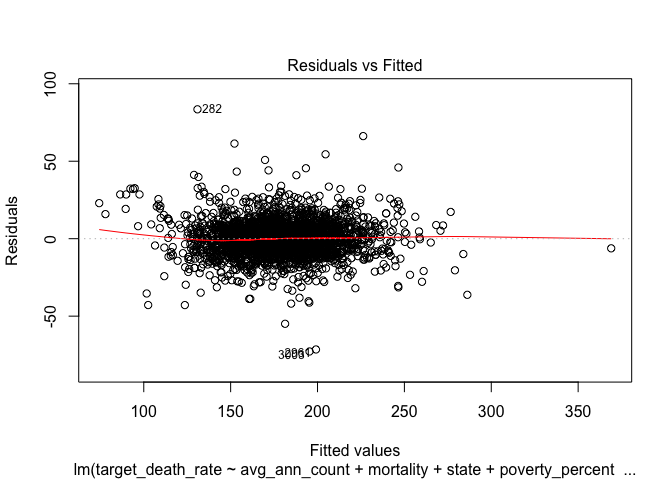

final\_project\_haokun
================
haokun yuan
12/6/2018

``` r
cancer_data = read_csv("./data/Cancer_Registry.csv") %>% 
  janitor::clean_names() %>% 
  mutate(study_per_cap = ifelse(study_per_cap == 0, 0, 1),
         mortality = avg_deaths_per_year/pop_est2015,
         geography = ifelse(str_detect(geography, "County") == TRUE,geography,str_replace(geography, ","," County,")),
         geography = str_replace(geography,"city"," City"),
         race_nonwhite = pct_asian + pct_other_race + pct_black)
```

    ## Parsed with column specification:
    ## cols(
    ##   .default = col_double(),
    ##   avgDeathsPerYear = col_integer(),
    ##   medIncome = col_integer(),
    ##   popEst2015 = col_integer(),
    ##   binnedInc = col_character(),
    ##   Geography = col_character()
    ## )

    ## See spec(...) for full column specifications.

``` r
         #race_nonwhite = ifelse(race_white >= 50,0,1))

sex_data = read_csv("./data/SEX01.csv") %>% 
  select(Areaname,SEX255209D) %>% 
  separate(Areaname, c("county","state"), sep = ", ") %>% 
  na.omit() %>% 
  mutate(state = state.name[match(state,state.abb)],
         county = paste(county,"County", sep = " ")) %>% 
  unite(geography,c(county, state), sep = ", ")
```

    ## Parsed with column specification:
    ## cols(
    ##   .default = col_character(),
    ##   SEX255203F = col_integer(),
    ##   SEX255203D = col_double(),
    ##   SEX255204F = col_integer(),
    ##   SEX255204D = col_double(),
    ##   SEX255205F = col_integer(),
    ##   SEX255205D = col_double(),
    ##   SEX255206F = col_integer(),
    ##   SEX255206D = col_double(),
    ##   SEX255207F = col_integer(),
    ##   SEX255207D = col_double(),
    ##   SEX255208F = col_integer(),
    ##   SEX255208D = col_double(),
    ##   SEX255209F = col_integer(),
    ##   SEX255209D = col_double(),
    ##   SEX300200F = col_integer(),
    ##   SEX300200D = col_double(),
    ##   SEX300210F = col_integer(),
    ##   SEX300210D = col_double(),
    ##   SEX320200F = col_integer(),
    ##   SEX320200D = col_double()
    ## )
    ## See spec(...) for full column specifications.

    ## Warning: Expected 2 pieces. Missing pieces filled with `NA` in 53 rows [1,
    ## 2, 70, 100, 116, 192, 251, 316, 325, 329, 330, 331, 399, 559, 565, 610,
    ## 713, 806, 906, 1012, ...].

``` r
age_data=read_csv("./data/AGE04.csv") %>% 
  select(Areaname,AGE775208D) %>% 
  separate(Areaname, c("county","state"), sep = ", ") %>% 
  na.omit() %>% 
  mutate(state = state.name[match(state,state.abb)],
         county = paste(county,"County", sep = " ")) %>% 
  unite(geography,c(county, state), sep = ", ")
```

    ## Parsed with column specification:
    ## cols(
    ##   .default = col_character(),
    ##   AGE770209F = col_integer(),
    ##   AGE770209D = col_integer(),
    ##   AGE775200F = col_integer(),
    ##   AGE775200D = col_double(),
    ##   AGE775201F = col_integer(),
    ##   AGE775201D = col_double(),
    ##   AGE775202F = col_integer(),
    ##   AGE775202D = col_double(),
    ##   AGE775203F = col_integer(),
    ##   AGE775203D = col_double(),
    ##   AGE775204F = col_integer(),
    ##   AGE775204D = col_double(),
    ##   AGE775205F = col_integer(),
    ##   AGE775205D = col_double(),
    ##   AGE775206F = col_integer(),
    ##   AGE775206D = col_double(),
    ##   AGE775207F = col_integer(),
    ##   AGE775207D = col_double(),
    ##   AGE775208F = col_integer(),
    ##   AGE775208D = col_double()
    ## )
    ## See spec(...) for full column specifications.

    ## Warning: Expected 2 pieces. Missing pieces filled with `NA` in 53 rows [1,
    ## 2, 70, 100, 116, 192, 251, 316, 325, 329, 330, 331, 399, 559, 565, 610,
    ## 713, 806, 906, 1012, ...].

``` r
cancer_1 = left_join(cancer_data,sex_data,by = "geography")
cancer_2 = left_join(cancer_1,age_data,by = "geography") 
#Virgina louisana DC,louis city
#age,education,race ,recode area

cancer_nocounty = cancer_2 %>% select(-geography)
summary(lm(target_death_rate ~ ., cancer_nocounty)) 
```

    ## 
    ## Call:
    ## lm(formula = target_death_rate ~ ., data = cancer_nocounty)
    ## 
    ## Residuals:
    ##     Min      1Q  Median      3Q     Max 
    ## -37.503  -5.461   0.005   5.162  71.119 
    ## 
    ## Coefficients: (1 not defined because of singularities)
    ##                                Estimate Std. Error t value Pr(>|t|)    
    ## (Intercept)                   4.574e+02  7.864e+02   0.582 0.561084    
    ## avg_ann_count                -3.274e-03  9.400e-04  -3.483 0.000537 ***
    ## avg_deaths_per_year           6.994e-03  4.879e-03   1.433 0.152373    
    ## incidence_rate                6.247e-02  1.055e-02   5.921 5.79e-09 ***
    ## med_income                    1.544e-04  1.805e-04   0.856 0.392616    
    ## pop_est2015                   3.246e-06  6.149e-06   0.528 0.597744    
    ## poverty_percent              -6.360e-01  2.441e-01  -2.606 0.009431 ** 
    ## study_per_cap                 2.399e-01  1.141e+00   0.210 0.833502    
    ## binned_inc(37413.8, 40362.7] -1.339e-01  2.121e+00  -0.063 0.949699    
    ## binned_inc(40362.7, 42724.4]  9.120e-01  2.282e+00   0.400 0.689551    
    ## binned_inc(42724.4, 45201]    3.070e+00  2.437e+00   1.260 0.208210    
    ## binned_inc(45201, 48021.6]   -2.249e+00  2.773e+00  -0.811 0.417753    
    ## binned_inc(48021.6, 51046.4] -2.124e+00  3.116e+00  -0.682 0.495631    
    ## binned_inc(51046.4, 54545.6]  7.192e-01  3.433e+00   0.209 0.834168    
    ## binned_inc(54545.6, 61494.5] -3.646e-01  4.028e+00  -0.091 0.927919    
    ## binned_inc(61494.5, 125635]   1.311e+00  6.138e+00   0.214 0.830986    
    ## binned_inc[22640, 34218.1]    2.780e+00  2.420e+00   1.149 0.251146    
    ## median_age                   -1.048e-02  9.083e-03  -1.154 0.249178    
    ## median_age_male              -4.266e-01  2.628e-01  -1.623 0.105088    
    ## median_age_female            -1.597e+00  2.822e-01  -5.660 2.49e-08 ***
    ## avg_household_size            1.039e-02  1.139e+00   0.009 0.992722    
    ## percent_married               3.393e-01  2.293e-01   1.480 0.139566    
    ## pct_no_hs18_24               -2.511e+00  7.863e+00  -0.319 0.749558    
    ## pct_hs18_24                  -2.559e+00  7.865e+00  -0.325 0.745010    
    ## pct_some_col18_24            -2.584e+00  7.866e+00  -0.329 0.742633    
    ## pct_bach_deg18_24            -2.989e+00  7.872e+00  -0.380 0.704280    
    ## pct_hs25_over                 1.339e-01  1.290e-01   1.038 0.299587    
    ## pct_bach_deg25_over          -2.105e-01  2.082e-01  -1.011 0.312547    
    ## pct_employed16_over          -8.029e-01  1.384e-01  -5.801 1.14e-08 ***
    ## pct_unemployed16_over        -1.136e-01  2.347e-01  -0.484 0.628400    
    ## pct_private_coverage          1.689e-01  3.749e-01   0.451 0.652481    
    ## pct_private_coverage_alone   -1.968e-01  4.342e-01  -0.453 0.650665    
    ## pct_emp_priv_coverage        -4.362e-02  1.511e-01  -0.289 0.772994    
    ## pct_public_coverage          -9.471e-01  4.612e-01  -2.054 0.040510 *  
    ## pct_public_coverage_alone     6.609e-01  5.279e-01   1.252 0.211168    
    ## pct_white                    -3.127e-02  7.662e-02  -0.408 0.683315    
    ## pct_black                     1.224e-02  7.796e-02   0.157 0.875328    
    ## pct_asian                    -1.595e-01  3.453e-01  -0.462 0.644205    
    ## pct_other_race               -1.565e-01  1.677e-01  -0.933 0.351123    
    ## pct_married_households       -4.486e-01  2.122e-01  -2.115 0.034926 *  
    ## birth_rate                    1.676e-01  2.573e-01   0.651 0.515176    
    ## mortality                     5.851e+04  1.577e+03  37.104  < 2e-16 ***
    ## race_nonwhite                        NA         NA      NA       NA    
    ## SEX255209D                    8.858e-01  2.801e-01   3.162 0.001655 ** 
    ## AGE775208D                   -4.292e+00  2.800e-01 -15.326  < 2e-16 ***
    ## ---
    ## Signif. codes:  0 '***' 0.001 '**' 0.01 '*' 0.05 '.' 0.1 ' ' 1
    ## 
    ## Residual standard error: 10.26 on 525 degrees of freedom
    ##   (2490 observations deleted due to missingness)
    ## Multiple R-squared:  0.8662, Adjusted R-squared:  0.8553 
    ## F-statistic: 79.07 on 43 and 525 DF,  p-value: < 2.2e-16

``` r
cancer_data %>% 
  select(target_death_rate,geography) %>% 
  arrange(desc(target_death_rate)) %>% 
  separate(geography, c("county", "state"), sep = ",") %>% 
  group_by(state) %>% 
  mutate(state_death = mean(target_death_rate)) %>% 
  distinct(state,state_death) %>% 
  arrange(desc(state_death)) 
```

    ## # A tibble: 51 x 2
    ## # Groups:   state [51]
    ##    state            state_death
    ##    <chr>                  <dbl>
    ##  1 " Kentucky"             215.
    ##  2 " Mississippi"          203.
    ##  3 " Tennessee"            201.
    ##  4 " Arkansas"             200.
    ##  5 " Louisiana"            198.
    ##  6 " West Virginia"        197.
    ##  7 " Oklahoma"             194.
    ##  8 " Alaska"               193.
    ##  9 " Alabama"              193.
    ## 10 " Missouri"             190.
    ## # ... with 41 more rows

``` r
#%>% 
 # plot_usmap(value = "state_death")
```

``` r
#cancer_data %>% 
  #select(avg_ann_count,avg_deaths_per_year,pop_est2015,incidence_rate,target_death_rate) %>% 
  #mutate(incidence_rate_1 = avg_ann_count/(pop_est2015/100000),
         #death_rate_1 = avg_deaths_per_year/(pop_est2015/100000)) %>% 
```

``` r
data_1 = cancer_data %>% 
  select(target_death_rate,med_income,poverty_percent,median_age,birth_rate)
data_continous = cancer_data %>% select(-geography,-study_per_cap,-binned_inc)
lm = glm(target_death_rate~.,data = data_continous)
summary(lm)
```

    ## 
    ## Call:
    ## glm(formula = target_death_rate ~ ., data = data_continous)
    ## 
    ## Deviance Residuals: 
    ##     Min       1Q   Median       3Q      Max  
    ## -57.467   -6.900   -0.072    6.378   76.540  
    ## 
    ## Coefficients: (1 not defined because of singularities)
    ##                              Estimate Std. Error t value Pr(>|t|)    
    ## (Intercept)                 7.778e+02  9.507e+02   0.818 0.413601    
    ## avg_ann_count              -6.427e-03  1.105e-03  -5.815 1.02e-08 ***
    ## avg_deaths_per_year         1.039e-02  5.701e-03   1.823 0.068839 .  
    ## incidence_rate              6.213e-02  1.123e-02   5.533 4.84e-08 ***
    ## med_income                  5.664e-04  1.367e-04   4.144 3.95e-05 ***
    ## pop_est2015                 1.061e-05  7.282e-06   1.458 0.145489    
    ## poverty_percent            -8.817e-02  2.563e-01  -0.344 0.731025    
    ## median_age                 -1.087e-02  1.115e-02  -0.975 0.330016    
    ## median_age_male            -1.175e+00  3.073e-01  -3.823 0.000146 ***
    ## median_age_female          -1.897e+00  3.382e-01  -5.609 3.21e-08 ***
    ## avg_household_size          1.444e-01  1.392e+00   0.104 0.917424    
    ## percent_married             7.495e-01  2.598e-01   2.886 0.004058 ** 
    ## pct_no_hs18_24             -5.878e+00  9.502e+00  -0.619 0.536401    
    ## pct_hs18_24                -5.843e+00  9.503e+00  -0.615 0.538911    
    ## pct_some_col18_24          -5.929e+00  9.504e+00  -0.624 0.533007    
    ## pct_bach_deg18_24          -6.444e+00  9.509e+00  -0.678 0.498249    
    ## pct_hs25_over               1.301e-01  1.542e-01   0.844 0.399075    
    ## pct_bach_deg25_over        -4.287e-01  2.471e-01  -1.735 0.083319 .  
    ## pct_employed16_over        -6.560e-01  1.625e-01  -4.036 6.20e-05 ***
    ## pct_unemployed16_over       6.883e-01  2.683e-01   2.565 0.010564 *  
    ## pct_private_coverage        3.458e-01  4.393e-01   0.787 0.431536    
    ## pct_private_coverage_alone -5.343e-01  5.161e-01  -1.035 0.301009    
    ## pct_emp_priv_coverage       3.901e-01  1.788e-01   2.181 0.029581 *  
    ## pct_public_coverage        -2.676e+00  5.337e-01  -5.015 7.15e-07 ***
    ## pct_public_coverage_alone   2.864e+00  6.047e-01   4.737 2.75e-06 ***
    ## pct_white                   1.111e-02  8.758e-02   0.127 0.899090    
    ## pct_black                   2.164e-01  8.364e-02   2.588 0.009910 ** 
    ## pct_asian                  -4.249e-01  4.034e-01  -1.053 0.292646    
    ## pct_other_race             -5.157e-01  1.994e-01  -2.585 0.009979 ** 
    ## pct_married_households     -5.032e-01  2.490e-01  -2.021 0.043786 *  
    ## birth_rate                 -5.151e-01  3.016e-01  -1.708 0.088259 .  
    ## mortality                   5.104e+04  1.740e+03  29.330  < 2e-16 ***
    ## race_nonwhite                      NA         NA      NA       NA    
    ## ---
    ## Signif. codes:  0 '***' 0.001 '**' 0.01 '*' 0.05 '.' 0.1 ' ' 1
    ## 
    ## (Dispersion parameter for gaussian family taken to be 160.808)
    ## 
    ##     Null deviance: 438870  on 590  degrees of freedom
    ## Residual deviance:  89892  on 559  degrees of freedom
    ##   (2456 observations deleted due to missingness)
    ## AIC: 4712.7
    ## 
    ## Number of Fisher Scoring iterations: 2

``` r
#step(lm,direction = "both")

summary(lm(formula = target_death_rate ~ incidence_rate + med_income + 
    median_age_male + percent_married + pct_no_hs18_24 + pct_hs18_24 + 
    pct_some_col18_24 + pct_bach_deg18_24 + pct_hs25_over + pct_bach_deg25_over + 
    pct_employed16_over + pct_private_coverage_alone + pct_emp_priv_coverage + 
    pct_public_coverage + pct_public_coverage_alone + pct_white + 
    pct_black + pct_other_race + pct_married_households, data = data_continous))
```

    ## 
    ## Call:
    ## lm(formula = target_death_rate ~ incidence_rate + med_income + 
    ##     median_age_male + percent_married + pct_no_hs18_24 + pct_hs18_24 + 
    ##     pct_some_col18_24 + pct_bach_deg18_24 + pct_hs25_over + pct_bach_deg25_over + 
    ##     pct_employed16_over + pct_private_coverage_alone + pct_emp_priv_coverage + 
    ##     pct_public_coverage + pct_public_coverage_alone + pct_white + 
    ##     pct_black + pct_other_race + pct_married_households, data = data_continous)
    ## 
    ## Residuals:
    ##    Min     1Q Median     3Q    Max 
    ## -79.88 -10.83   0.16  10.97 107.32 
    ## 
    ## Coefficients:
    ##                              Estimate Std. Error t value Pr(>|t|)    
    ## (Intercept)                 2.732e+03  1.484e+03   1.842  0.06604 .  
    ## incidence_rate              1.619e-01  1.670e-02   9.696  < 2e-16 ***
    ## med_income                  3.088e-04  1.755e-04   1.760  0.07899 .  
    ## median_age_male            -6.698e-01  3.295e-01  -2.033  0.04255 *  
    ## percent_married             1.939e+00  3.926e-01   4.939 1.03e-06 ***
    ## pct_no_hs18_24             -2.578e+01  1.482e+01  -1.740  0.08247 .  
    ## pct_hs18_24                -2.539e+01  1.483e+01  -1.712  0.08738 .  
    ## pct_some_col18_24          -2.548e+01  1.483e+01  -1.718  0.08629 .  
    ## pct_bach_deg18_24          -2.618e+01  1.483e+01  -1.765  0.07806 .  
    ## pct_hs25_over               5.834e-01  2.376e-01   2.456  0.01436 *  
    ## pct_bach_deg25_over        -9.527e-01  3.788e-01  -2.515  0.01217 *  
    ## pct_employed16_over        -8.915e-01  2.254e-01  -3.955 8.61e-05 ***
    ## pct_private_coverage_alone -7.551e-01  3.759e-01  -2.009  0.04503 *  
    ## pct_emp_priv_coverage       6.314e-01  2.712e-01   2.328  0.02025 *  
    ## pct_public_coverage        -1.175e+00  4.431e-01  -2.652  0.00822 ** 
    ## pct_public_coverage_alone   1.441e+00  4.841e-01   2.976  0.00304 ** 
    ## pct_white                   2.010e-01  1.329e-01   1.512  0.13098    
    ## pct_black                   2.963e-01  1.244e-01   2.382  0.01755 *  
    ## pct_other_race             -9.089e-01  3.057e-01  -2.973  0.00307 ** 
    ## pct_married_households     -2.191e+00  3.660e-01  -5.985 3.82e-09 ***
    ## ---
    ## Signif. codes:  0 '***' 0.001 '**' 0.01 '*' 0.05 '.' 0.1 ' ' 1
    ## 
    ## Residual standard error: 20.11 on 571 degrees of freedom
    ##   (2456 observations deleted due to missingness)
    ## Multiple R-squared:  0.4737, Adjusted R-squared:  0.4561 
    ## F-statistic: 27.04 on 19 and 571 DF,  p-value: < 2.2e-16

``` r
## leading cause of cancer, only most difference prostate,breast
```

``` r
summary(cancer_data)
```

    ##  avg_ann_count     avg_deaths_per_year target_death_rate incidence_rate  
    ##  Min.   :    6.0   Min.   :    3       Min.   : 59.7     Min.   : 201.3  
    ##  1st Qu.:   76.0   1st Qu.:   28       1st Qu.:161.2     1st Qu.: 420.3  
    ##  Median :  171.0   Median :   61       Median :178.1     Median : 453.5  
    ##  Mean   :  606.3   Mean   :  186       Mean   :178.7     Mean   : 448.3  
    ##  3rd Qu.:  518.0   3rd Qu.:  149       3rd Qu.:195.2     3rd Qu.: 480.9  
    ##  Max.   :38150.0   Max.   :14010       Max.   :362.8     Max.   :1206.9  
    ##                                                                          
    ##    med_income      pop_est2015       poverty_percent study_per_cap   
    ##  Min.   : 22640   Min.   :     827   Min.   : 3.20   Min.   :0.0000  
    ##  1st Qu.: 38882   1st Qu.:   11684   1st Qu.:12.15   1st Qu.:0.0000  
    ##  Median : 45207   Median :   26643   Median :15.90   Median :0.0000  
    ##  Mean   : 47063   Mean   :  102637   Mean   :16.88   Mean   :0.3663  
    ##  3rd Qu.: 52492   3rd Qu.:   68671   3rd Qu.:20.40   3rd Qu.:1.0000  
    ##  Max.   :125635   Max.   :10170292   Max.   :47.40   Max.   :1.0000  
    ##                                                                      
    ##   binned_inc          median_age     median_age_male median_age_female
    ##  Length:3047        Min.   : 22.30   Min.   :22.40   Min.   :22.30    
    ##  Class :character   1st Qu.: 37.70   1st Qu.:36.35   1st Qu.:39.10    
    ##  Mode  :character   Median : 41.00   Median :39.60   Median :42.40    
    ##                     Mean   : 45.27   Mean   :39.57   Mean   :42.15    
    ##                     3rd Qu.: 44.00   3rd Qu.:42.50   3rd Qu.:45.30    
    ##                     Max.   :624.00   Max.   :64.70   Max.   :65.70    
    ##                                                                       
    ##   geography         avg_household_size percent_married pct_no_hs18_24 
    ##  Length:3047        Min.   :0.0221     Min.   :23.10   Min.   : 0.00  
    ##  Class :character   1st Qu.:2.3700     1st Qu.:47.75   1st Qu.:12.80  
    ##  Mode  :character   Median :2.5000     Median :52.40   Median :17.10  
    ##                     Mean   :2.4797     Mean   :51.77   Mean   :18.22  
    ##                     3rd Qu.:2.6300     3rd Qu.:56.40   3rd Qu.:22.70  
    ##                     Max.   :3.9700     Max.   :72.50   Max.   :64.10  
    ##                                                                       
    ##   pct_hs18_24   pct_some_col18_24 pct_bach_deg18_24 pct_hs25_over  
    ##  Min.   : 0.0   Min.   : 7.10     Min.   : 0.000    Min.   : 7.50  
    ##  1st Qu.:29.2   1st Qu.:34.00     1st Qu.: 3.100    1st Qu.:30.40  
    ##  Median :34.7   Median :40.40     Median : 5.400    Median :35.30  
    ##  Mean   :35.0   Mean   :40.98     Mean   : 6.158    Mean   :34.80  
    ##  3rd Qu.:40.7   3rd Qu.:46.40     3rd Qu.: 8.200    3rd Qu.:39.65  
    ##  Max.   :72.5   Max.   :79.00     Max.   :51.800    Max.   :54.80  
    ##                 NA's   :2285                                       
    ##  pct_bach_deg25_over pct_employed16_over pct_unemployed16_over
    ##  Min.   : 2.50       Min.   :17.60       Min.   : 0.400       
    ##  1st Qu.: 9.40       1st Qu.:48.60       1st Qu.: 5.500       
    ##  Median :12.30       Median :54.50       Median : 7.600       
    ##  Mean   :13.28       Mean   :54.15       Mean   : 7.852       
    ##  3rd Qu.:16.10       3rd Qu.:60.30       3rd Qu.: 9.700       
    ##  Max.   :42.20       Max.   :80.10       Max.   :29.400       
    ##                      NA's   :152                              
    ##  pct_private_coverage pct_private_coverage_alone pct_emp_priv_coverage
    ##  Min.   :22.30        Min.   :15.70              Min.   :13.5         
    ##  1st Qu.:57.20        1st Qu.:41.00              1st Qu.:34.5         
    ##  Median :65.10        Median :48.70              Median :41.1         
    ##  Mean   :64.35        Mean   :48.45              Mean   :41.2         
    ##  3rd Qu.:72.10        3rd Qu.:55.60              3rd Qu.:47.7         
    ##  Max.   :92.30        Max.   :78.90              Max.   :70.7         
    ##                       NA's   :609                                     
    ##  pct_public_coverage pct_public_coverage_alone   pct_white     
    ##  Min.   :11.20       Min.   : 2.60             Min.   : 10.20  
    ##  1st Qu.:30.90       1st Qu.:14.85             1st Qu.: 77.30  
    ##  Median :36.30       Median :18.80             Median : 90.06  
    ##  Mean   :36.25       Mean   :19.24             Mean   : 83.65  
    ##  3rd Qu.:41.55       3rd Qu.:23.10             3rd Qu.: 95.45  
    ##  Max.   :65.10       Max.   :46.60             Max.   :100.00  
    ##                                                                
    ##    pct_black         pct_asian       pct_other_race   
    ##  Min.   : 0.0000   Min.   : 0.0000   Min.   : 0.0000  
    ##  1st Qu.: 0.6207   1st Qu.: 0.2542   1st Qu.: 0.2952  
    ##  Median : 2.2476   Median : 0.5498   Median : 0.8262  
    ##  Mean   : 9.1080   Mean   : 1.2540   Mean   : 1.9835  
    ##  3rd Qu.:10.5097   3rd Qu.: 1.2210   3rd Qu.: 2.1780  
    ##  Max.   :85.9478   Max.   :42.6194   Max.   :41.9303  
    ##                                                       
    ##  pct_married_households   birth_rate       mortality       
    ##  Min.   :22.99          Min.   : 0.000   Min.   :0.000485  
    ##  1st Qu.:47.76          1st Qu.: 4.521   1st Qu.:0.001888  
    ##  Median :51.67          Median : 5.381   Median :0.002290  
    ##  Mean   :51.24          Mean   : 5.640   Mean   :0.002287  
    ##  3rd Qu.:55.40          3rd Qu.: 6.494   3rd Qu.:0.002681  
    ##  Max.   :78.08          Max.   :21.326   Max.   :0.005136  
    ##                                                            
    ##  race_nonwhite   
    ##  Min.   : 0.000  
    ##  1st Qu.: 1.964  
    ##  Median : 5.569  
    ##  Mean   :12.345  
    ##  3rd Qu.:16.974  
    ##  Max.   :86.066  
    ## 

``` r
d = cancer_data %>% 
  mutate(white = ifelse(pct_white >= 77.30,1,0))
  
pairs(data_1)
```


``` r
summary(lm(target_death_rate~med_income+poverty_percent+median_age+birth_rate+white,d))
```

    ## 
    ## Call:
    ## lm(formula = target_death_rate ~ med_income + poverty_percent + 
    ##     median_age + birth_rate + white, data = d)
    ## 
    ## Residuals:
    ##      Min       1Q   Median       3Q      Max 
    ## -123.104  -13.829    0.949   14.709  169.392 
    ## 
    ## Coefficients:
    ##                   Estimate Std. Error t value Pr(>|t|)    
    ## (Intercept)      1.994e+02  5.657e+00  35.244  < 2e-16 ***
    ## med_income      -5.935e-04  6.388e-05  -9.290  < 2e-16 ***
    ## poverty_percent  9.173e-01  1.305e-01   7.029 2.56e-12 ***
    ## median_age       4.111e-03  9.872e-03   0.416   0.6771    
    ## birth_rate      -1.221e+00  2.248e-01  -5.433 5.98e-08 ***
    ## white           -2.088e+00  1.196e+00  -1.745   0.0811 .  
    ## ---
    ## Signif. codes:  0 '***' 0.001 '**' 0.01 '*' 0.05 '.' 0.1 ' ' 1
    ## 
    ## Residual standard error: 24.62 on 3041 degrees of freedom
    ## Multiple R-squared:  0.2142, Adjusted R-squared:  0.2129 
    ## F-statistic: 165.7 on 5 and 3041 DF,  p-value: < 2.2e-16

``` r
l = cancer_2 %>% 
  #select(target_death_rate,geography) %>% 
  arrange(desc(target_death_rate)) %>% 
  separate(geography, c("county", "state"), sep = ",")

summary(lm(target_death_rate~state+med_income+poverty_percent+median_age+birth_rate+incidence_rate,l))
```

    ## 
    ## Call:
    ## lm(formula = target_death_rate ~ state + med_income + poverty_percent + 
    ##     median_age + birth_rate + incidence_rate, data = l)
    ## 
    ## Residuals:
    ##      Min       1Q   Median       3Q      Max 
    ## -139.907  -10.875   -0.408   10.801  115.934 
    ## 
    ## Coefficients:
    ##                              Estimate Std. Error t value Pr(>|t|)    
    ## (Intercept)                 1.043e+02  5.949e+00  17.524  < 2e-16 ***
    ## state Alaska                3.003e+01  5.203e+00   5.771 8.66e-09 ***
    ## state Arizona              -1.902e+01  5.550e+00  -3.426 0.000620 ***
    ## state Arkansas              1.292e+01  3.274e+00   3.946 8.12e-05 ***
    ## state California           -1.541e+01  3.550e+00  -4.340 1.47e-05 ***
    ## state Colorado             -2.342e+01  3.531e+00  -6.633 3.87e-11 ***
    ## state Connecticut          -1.334e+01  7.248e+00  -1.841 0.065769 .  
    ## state Delaware             -5.977e+00  1.131e+01  -0.529 0.597124    
    ## state District of Columbia  4.133e+00  1.930e+01   0.214 0.830404    
    ## state Florida              -2.812e+00  3.377e+00  -0.833 0.404955    
    ## state Georgia              -7.239e+00  2.863e+00  -2.529 0.011497 *  
    ## state Hawaii               -2.064e+01  9.888e+00  -2.088 0.036896 *  
    ## state Idaho                -2.370e+01  3.851e+00  -6.154 8.53e-10 ***
    ## state Illinois             -1.850e+00  3.106e+00  -0.595 0.551565    
    ## state Indiana               8.408e+00  3.173e+00   2.650 0.008086 ** 
    ## state Iowa                 -1.337e+01  3.157e+00  -4.236 2.35e-05 ***
    ## state Kansas               -1.132e+01  3.138e+00  -3.608 0.000313 ***
    ## state Kentucky              1.302e+01  2.995e+00   4.346 1.43e-05 ***
    ## state Louisiana             1.938e+00  3.397e+00   0.570 0.568471    
    ## state Maine                -3.829e+00  5.369e+00  -0.713 0.475826    
    ## state Maryland              6.462e+00  4.681e+00   1.380 0.167541    
    ## state Massachusetts        -1.078e+01  5.716e+00  -1.886 0.059435 .  
    ## state Michigan             -1.912e+00  3.224e+00  -0.593 0.553177    
    ## state Minnesota            -1.374e+01  3.244e+00  -4.235 2.35e-05 ***
    ## state Mississippi           5.129e+00  3.209e+00   1.598 0.110110    
    ## state Missouri              6.633e+00  3.019e+00   2.197 0.028103 *  
    ## state Montana              -2.024e+01  3.691e+00  -5.485 4.49e-08 ***
    ## state Nebraska             -1.229e+01  3.310e+00  -3.712 0.000209 ***
    ## state Nevada                6.656e-01  5.255e+00   0.127 0.899225    
    ## state New Hampshire        -7.296e+00  6.550e+00  -1.114 0.265414    
    ## state New Jersey           -5.281e+00  4.950e+00  -1.067 0.286134    
    ## state New Mexico           -1.981e+01  4.191e+00  -4.727 2.38e-06 ***
    ## state New York             -1.505e+01  3.467e+00  -4.341 1.46e-05 ***
    ## state North Carolina       -1.059e+01  3.085e+00  -3.432 0.000607 ***
    ## state North Dakota         -9.953e+00  3.703e+00  -2.688 0.007223 ** 
    ## state Ohio                  6.425e+00  3.194e+00   2.012 0.044336 *  
    ## state Oklahoma              1.141e+01  3.262e+00   3.496 0.000479 ***
    ## state Oregon               -1.236e+01  4.005e+00  -3.086 0.002046 ** 
    ## state Pennsylvania         -9.371e+00  3.404e+00  -2.753 0.005940 ** 
    ## state Rhode Island         -1.115e+01  8.946e+00  -1.246 0.212944    
    ## state South Carolina       -8.337e-01  3.706e+00  -0.225 0.822008    
    ## state South Dakota         -1.440e+01  3.521e+00  -4.089 4.44e-05 ***
    ## state Tennessee             8.973e+00  3.108e+00   2.887 0.003919 ** 
    ## state Texas                -2.003e+00  2.771e+00  -0.723 0.469886    
    ## state Utah                 -2.792e+01  4.487e+00  -6.222 5.61e-10 ***
    ## state Vermont              -5.330e+00  5.679e+00  -0.939 0.348044    
    ## state Virginia              4.462e+00  2.960e+00   1.507 0.131850    
    ## state Washington           -1.067e+01  3.920e+00  -2.722 0.006536 ** 
    ## state West Virginia         6.442e+00  3.534e+00   1.823 0.068461 .  
    ## state Wisconsin            -3.818e+00  3.357e+00  -1.137 0.255560    
    ## state Wyoming              -5.943e+00  4.737e+00  -1.255 0.209701    
    ## med_income                 -5.199e-04  5.195e-05 -10.007  < 2e-16 ***
    ## poverty_percent             7.234e-01  1.027e-01   7.045 2.29e-12 ***
    ## median_age                  8.040e-03  7.737e-03   1.039 0.298820    
    ## birth_rate                 -2.322e-02  1.856e-01  -0.125 0.900422    
    ## incidence_rate              2.002e-01  7.482e-03  26.755  < 2e-16 ***
    ## ---
    ## Signif. codes:  0 '***' 0.001 '**' 0.01 '*' 0.05 '.' 0.1 ' ' 1
    ## 
    ## Residual standard error: 19.1 on 3003 degrees of freedom
    ## Multiple R-squared:  0.5353, Adjusted R-squared:  0.5268 
    ## F-statistic: 62.89 on 55 and 3003 DF,  p-value: < 2.2e-16

``` r
#step(lm(formula = target_death_rate ~ avg_ann_count + mortality+ state + med_income + poverty_percent + incidence_rate+SEX255209D+AGE775208D+pct_other_race+percent_married+pct_private_coverage+study_per_cap, data = l),direction = "both")

l = l %>% 
  select(-county)

summary(lm(formula = target_death_rate ~ ., data = l))
```

    ## 
    ## Call:
    ## lm(formula = target_death_rate ~ ., data = l)
    ## 
    ## Residuals:
    ##     Min      1Q  Median      3Q     Max 
    ## -37.835  -5.075  -0.089   4.775  58.774 
    ## 
    ## Coefficients: (1 not defined because of singularities)
    ##                                Estimate Std. Error t value Pr(>|t|)    
    ## (Intercept)                   6.646e+02  7.797e+02   0.852  0.39442    
    ## avg_ann_count                -1.810e-02  5.742e-03  -3.153  0.00172 ** 
    ## avg_deaths_per_year           4.491e-02  1.461e-02   3.074  0.00223 ** 
    ## incidence_rate                5.413e-02  1.220e-02   4.437 1.13e-05 ***
    ## med_income                    1.321e-04  2.013e-04   0.656  0.51221    
    ## pop_est2015                   7.089e-06  6.928e-06   1.023  0.30670    
    ## poverty_percent              -6.137e-01  2.531e-01  -2.424  0.01570 *  
    ## study_per_cap                 8.111e-01  1.149e+00   0.706  0.48043    
    ## binned_inc(37413.8, 40362.7]  1.124e-01  2.121e+00   0.053  0.95776    
    ## binned_inc(40362.7, 42724.4]  1.526e+00  2.277e+00   0.670  0.50315    
    ## binned_inc(42724.4, 45201]    4.329e+00  2.473e+00   1.750  0.08071 .  
    ## binned_inc(45201, 48021.6]    1.102e-02  2.850e+00   0.004  0.99692    
    ## binned_inc(48021.6, 51046.4]  9.487e-01  3.225e+00   0.294  0.76879    
    ## binned_inc(51046.4, 54545.6]  1.387e+00  3.518e+00   0.394  0.69360    
    ## binned_inc(54545.6, 61494.5]  1.098e+00  4.130e+00   0.266  0.79054    
    ## binned_inc(61494.5, 125635]   4.123e+00  6.291e+00   0.655  0.51252    
    ## binned_inc[22640, 34218.1]    4.583e+00  2.478e+00   1.850  0.06498 .  
    ## median_age                   -5.731e-03  8.989e-03  -0.638  0.52409    
    ## median_age_male              -3.785e-01  2.665e-01  -1.420  0.15620    
    ## median_age_female            -1.786e+00  2.918e-01  -6.121 1.93e-09 ***
    ## state Arizona                -8.700e+00  6.255e+00  -1.391  0.16489    
    ## state Arkansas               -4.271e+00  4.343e+00  -0.983  0.32590    
    ## state California             -1.304e+01  6.366e+00  -2.048  0.04106 *  
    ## state Colorado               -1.295e+01  5.041e+00  -2.570  0.01047 *  
    ## state Connecticut            -8.087e+00  1.108e+01  -0.730  0.46597    
    ## state Delaware                3.201e+00  8.090e+00   0.396  0.69253    
    ## state Florida                -2.040e+00  4.976e+00  -0.410  0.68200    
    ## state Georgia                -4.368e+00  4.061e+00  -1.076  0.28261    
    ## state Idaho                  -2.367e+01  5.092e+00  -4.649 4.32e-06 ***
    ## state Illinois               -8.286e+00  4.532e+00  -1.828  0.06812 .  
    ## state Indiana                -5.985e+00  4.288e+00  -1.396  0.16345    
    ## state Iowa                   -1.377e+01  4.485e+00  -3.069  0.00227 ** 
    ## state Kansas                  1.783e+01  1.176e+01   1.516  0.13020    
    ## state Kentucky                1.075e+00  4.135e+00   0.260  0.79504    
    ## state Maine                  -4.447e+00  8.124e+00  -0.547  0.58439    
    ## state Maryland               -6.943e+00  5.348e+00  -1.298  0.19481    
    ## state Massachusetts          -6.864e+00  1.101e+01  -0.623  0.53327    
    ## state Michigan               -5.730e+00  4.742e+00  -1.208  0.22753    
    ## state Minnesota               2.130e+01  1.151e+01   1.851  0.06480 .  
    ## state Mississippi            -2.964e+00  4.501e+00  -0.658  0.51056    
    ## state Missouri               -8.599e+00  4.284e+00  -2.007  0.04529 *  
    ## state Montana                -5.847e-01  5.831e+00  -0.100  0.92017    
    ## state Nebraska               -7.090e+00  5.086e+00  -1.394  0.16400    
    ## state Nevada                  2.406e+01  1.243e+01   1.935  0.05358 .  
    ## state New Hampshire          -9.777e+00  6.389e+00  -1.530  0.12661    
    ## state New Jersey             -1.078e+01  5.777e+00  -1.865  0.06275 .  
    ## state New Mexico             -5.947e+00  6.735e+00  -0.883  0.37767    
    ## state New York               -6.533e+00  5.167e+00  -1.264  0.20670    
    ## state North Carolina         -3.702e+00  4.321e+00  -0.857  0.39200    
    ## state North Dakota           -9.804e+00  5.484e+00  -1.788  0.07447 .  
    ## state Ohio                   -8.959e+00  4.746e+00  -1.888  0.05965 .  
    ## state Oklahoma               -5.215e+00  4.673e+00  -1.116  0.26500    
    ## state Oregon                 -6.856e+00  5.538e+00  -1.238  0.21636    
    ## state Pennsylvania           -1.281e+01  4.702e+00  -2.725  0.00667 ** 
    ## state South Carolina          1.134e-01  5.216e+00   0.022  0.98266    
    ## state South Dakota           -1.245e+01  5.693e+00  -2.187  0.02922 *  
    ## state Tennessee              -9.679e-01  4.287e+00  -0.226  0.82147    
    ## state Texas                  -8.064e+00  4.191e+00  -1.924  0.05493 .  
    ## state Utah                   -2.612e+01  8.311e+00  -3.143  0.00178 ** 
    ## state Vermont                -2.531e+00  1.097e+01  -0.231  0.81771    
    ## state Virginia               -2.053e+00  4.418e+00  -0.465  0.64241    
    ## state Washington             -1.290e+01  5.010e+00  -2.575  0.01033 *  
    ## state West Virginia          -2.499e+00  4.681e+00  -0.534  0.59376    
    ## state Wisconsin              -8.909e+00  4.777e+00  -1.865  0.06279 .  
    ## state Wyoming                -6.491e+00  7.000e+00  -0.927  0.35425    
    ## avg_household_size            4.047e-01  1.120e+00   0.361  0.71800    
    ## percent_married               1.867e-01  2.400e-01   0.778  0.43698    
    ## pct_no_hs18_24               -4.518e+00  7.793e+00  -0.580  0.56240    
    ## pct_hs18_24                  -4.615e+00  7.796e+00  -0.592  0.55420    
    ## pct_some_col18_24            -4.628e+00  7.796e+00  -0.594  0.55302    
    ## pct_bach_deg18_24            -5.070e+00  7.799e+00  -0.650  0.51599    
    ## pct_hs25_over                 2.375e-01  1.607e-01   1.478  0.14015    
    ## pct_bach_deg25_over           6.252e-02  2.317e-01   0.270  0.78746    
    ## pct_employed16_over          -5.935e-01  1.572e-01  -3.775  0.00018 ***
    ## pct_unemployed16_over        -1.074e-01  2.542e-01  -0.423  0.67283    
    ## pct_private_coverage          3.471e-01  4.039e-01   0.859  0.39065    
    ## pct_private_coverage_alone   -3.564e-01  4.648e-01  -0.767  0.44358    
    ## pct_emp_priv_coverage        -1.628e-01  1.691e-01  -0.962  0.33642    
    ## pct_public_coverage          -8.390e-01  5.041e-01  -1.664  0.09669 .  
    ## pct_public_coverage_alone     5.524e-01  5.505e-01   1.003  0.31616    
    ## pct_white                    -3.798e-02  8.567e-02  -0.443  0.65775    
    ## pct_black                    -6.097e-02  9.871e-02  -0.618  0.53708    
    ## pct_asian                     1.569e-01  3.768e-01   0.416  0.67730    
    ## pct_other_race               -9.166e-02  1.746e-01  -0.525  0.59988    
    ## pct_married_households       -2.881e-01  2.184e-01  -1.319  0.18773    
    ## birth_rate                    3.034e-01  2.579e-01   1.176  0.24004    
    ## mortality                     5.785e+04  1.606e+03  36.020  < 2e-16 ***
    ## race_nonwhite                        NA         NA      NA       NA    
    ## SEX255209D                    6.761e-01  3.000e-01   2.253  0.02468 *  
    ## AGE775208D                   -4.049e+00  3.088e-01 -13.113  < 2e-16 ***
    ## ---
    ## Signif. codes:  0 '***' 0.001 '**' 0.01 '*' 0.05 '.' 0.1 ' ' 1
    ## 
    ## Residual standard error: 9.76 on 480 degrees of freedom
    ##   (2490 observations deleted due to missingness)
    ## Multiple R-squared:  0.8893, Adjusted R-squared:  0.869 
    ## F-statistic: 43.82 on 88 and 480 DF,  p-value: < 2.2e-16

``` r
#step(lm(formula = target_death_rate ~ ., data = l))

summary(lm(formula = target_death_rate ~ avg_ann_count + mortality+ state + poverty_percent + incidence_rate+SEX255209D+AGE775208D+pct_other_race+percent_married+pct_private_coverage+study_per_cap, data = l))
```

    ## 
    ## Call:
    ## lm(formula = target_death_rate ~ avg_ann_count + mortality + 
    ##     state + poverty_percent + incidence_rate + SEX255209D + AGE775208D + 
    ##     pct_other_race + percent_married + pct_private_coverage + 
    ##     study_per_cap, data = l)
    ## 
    ## Residuals:
    ##     Min      1Q  Median      3Q     Max 
    ## -72.803  -5.759  -0.014   5.538  83.499 
    ## 
    ## Coefficients:
    ##                        Estimate Std. Error t value Pr(>|t|)    
    ## (Intercept)           1.133e+02  8.174e+00  13.860  < 2e-16 ***
    ## avg_ann_count        -2.389e-04  1.656e-04  -1.443 0.149082    
    ## mortality             5.088e+04  6.790e+02  74.937  < 2e-16 ***
    ## state Arizona        -2.708e+00  3.174e+00  -0.853 0.393648    
    ## state Arkansas        2.796e+00  1.870e+00   1.495 0.135024    
    ## state California     -1.195e+01  2.098e+00  -5.696 1.35e-08 ***
    ## state Colorado       -1.669e+01  2.051e+00  -8.139 5.86e-16 ***
    ## state Connecticut    -1.681e+01  4.090e+00  -4.110 4.07e-05 ***
    ## state Delaware        1.578e+00  6.373e+00   0.248 0.804478    
    ## state Florida         3.659e+00  2.002e+00   1.827 0.067740 .  
    ## state Georgia        -4.335e+00  1.624e+00  -2.670 0.007621 ** 
    ## state Hawaii         -1.020e+01  5.569e+00  -1.832 0.067012 .  
    ## state Idaho          -1.057e+01  2.202e+00  -4.798 1.68e-06 ***
    ## state Illinois       -5.978e+00  1.765e+00  -3.387 0.000717 ***
    ## state Indiana         1.479e+00  1.798e+00   0.822 0.410866    
    ## state Iowa           -8.338e+00  1.794e+00  -4.647 3.52e-06 ***
    ## state Kansas         -5.576e+00  1.809e+00  -3.082 0.002073 ** 
    ## state Kentucky        4.822e+00  1.715e+00   2.811 0.004975 ** 
    ## state Maine          -1.294e+01  3.042e+00  -4.254 2.17e-05 ***
    ## state Maryland       -3.019e+00  2.666e+00  -1.132 0.257522    
    ## state Massachusetts  -1.203e+01  3.242e+00  -3.712 0.000210 ***
    ## state Michigan       -5.698e+00  1.832e+00  -3.110 0.001890 ** 
    ## state Minnesota      -8.095e+00  1.863e+00  -4.344 1.45e-05 ***
    ## state Mississippi     1.857e+00  1.821e+00   1.020 0.307800    
    ## state Missouri        1.504e+00  1.713e+00   0.878 0.379791    
    ## state Montana        -4.732e+00  2.109e+00  -2.244 0.024901 *  
    ## state Nebraska       -3.645e+00  1.887e+00  -1.931 0.053568 .  
    ## state Nevada         -1.405e+00  3.096e+00  -0.454 0.649978    
    ## state New Hampshire  -1.063e+01  3.698e+00  -2.876 0.004063 ** 
    ## state New Jersey     -1.124e+01  2.789e+00  -4.030 5.73e-05 ***
    ## state New Mexico     -1.220e+01  2.509e+00  -4.861 1.23e-06 ***
    ## state New York       -1.216e+01  1.981e+00  -6.138 9.48e-10 ***
    ## state North Carolina -5.215e+00  1.753e+00  -2.975 0.002957 ** 
    ## state North Dakota    7.189e+00  2.130e+00   3.374 0.000750 ***
    ## state Ohio           -8.019e-01  1.809e+00  -0.443 0.657537    
    ## state Oklahoma        7.154e+00  1.869e+00   3.829 0.000132 ***
    ## state Oregon         -6.041e+00  2.275e+00  -2.655 0.007973 ** 
    ## state Pennsylvania   -7.492e+00  1.938e+00  -3.865 0.000113 ***
    ## state Rhode Island   -1.467e+01  5.024e+00  -2.919 0.003534 ** 
    ## state South Carolina -1.214e+00  2.096e+00  -0.579 0.562338    
    ## state South Dakota   -2.551e+00  1.992e+00  -1.280 0.200533    
    ## state Tennessee       3.653e+00  1.763e+00   2.072 0.038359 *  
    ## state Texas           1.534e+00  1.629e+00   0.942 0.346433    
    ## state Utah           -7.605e+00  2.558e+00  -2.973 0.002974 ** 
    ## state Vermont        -8.790e+00  3.223e+00  -2.728 0.006419 ** 
    ## state Virginia       -3.364e+00  1.759e+00  -1.912 0.055947 .  
    ## state Washington     -5.835e+00  2.243e+00  -2.602 0.009323 ** 
    ## state West Virginia  -2.751e+00  1.999e+00  -1.376 0.168786    
    ## state Wisconsin      -6.837e+00  1.908e+00  -3.583 0.000346 ***
    ## state Wyoming        -2.041e+00  2.680e+00  -0.762 0.446353    
    ## poverty_percent       4.297e-02  7.871e-02   0.546 0.585117    
    ## incidence_rate        8.342e-02  4.973e-03  16.773  < 2e-16 ***
    ## SEX255209D            4.543e-01  1.054e-01   4.309 1.70e-05 ***
    ## AGE775208D           -5.599e+00  9.664e-02 -57.938  < 2e-16 ***
    ## pct_other_race        1.982e-01  7.016e-02   2.825 0.004765 ** 
    ## percent_married      -2.183e-01  5.087e-02  -4.291 1.84e-05 ***
    ## pct_private_coverage -1.832e-01  4.226e-02  -4.335 1.51e-05 ***
    ## study_per_cap         2.876e-01  4.943e-01   0.582 0.560772    
    ## ---
    ## Signif. codes:  0 '***' 0.001 '**' 0.01 '*' 0.05 '.' 0.1 ' ' 1
    ## 
    ## Residual standard error: 10.74 on 2883 degrees of freedom
    ##   (118 observations deleted due to missingness)
    ## Multiple R-squared:  0.8516, Adjusted R-squared:  0.8487 
    ## F-statistic: 290.3 on 57 and 2883 DF,  p-value: < 2.2e-16

``` r
summary(lm(formula = target_death_rate ~ avg_ann_count + incidence_rate +state + med_income + poverty_percent+pct_other_race +percent_married+pct_private_coverage+study_per_cap, data = l))
```

    ## 
    ## Call:
    ## lm(formula = target_death_rate ~ avg_ann_count + incidence_rate + 
    ##     state + med_income + poverty_percent + pct_other_race + percent_married + 
    ##     pct_private_coverage + study_per_cap, data = l)
    ## 
    ## Residuals:
    ##     Min      1Q  Median      3Q     Max 
    ## -133.11  -10.57    0.00   10.56  119.43 
    ## 
    ## Coefficients:
    ##                              Estimate Std. Error t value Pr(>|t|)    
    ## (Intercept)                 1.523e+02  1.038e+01  14.668  < 2e-16 ***
    ## avg_ann_count              -8.091e-04  2.896e-04  -2.794 0.005235 ** 
    ## incidence_rate              2.049e-01  7.493e-03  27.348  < 2e-16 ***
    ## state Alaska                1.560e+01  5.322e+00   2.932 0.003397 ** 
    ## state Arizona              -2.052e+01  5.501e+00  -3.731 0.000194 ***
    ## state Arkansas              8.405e+00  3.252e+00   2.585 0.009786 ** 
    ## state California           -1.707e+01  3.635e+00  -4.696 2.77e-06 ***
    ## state Colorado             -2.820e+01  3.515e+00  -8.023 1.46e-15 ***
    ## state Connecticut          -1.567e+01  7.151e+00  -2.191 0.028527 *  
    ## state Delaware             -7.626e+00  1.111e+01  -0.686 0.492713    
    ## state District of Columbia  2.204e+00  1.901e+01   0.116 0.907709    
    ## state Florida              -6.622e+00  3.385e+00  -1.956 0.050535 .  
    ## state Georgia              -1.034e+01  2.830e+00  -3.653 0.000263 ***
    ## state Hawaii               -2.208e+01  9.714e+00  -2.273 0.023076 *  
    ## state Idaho                -2.607e+01  3.793e+00  -6.873 7.64e-12 ***
    ## state Illinois             -3.244e+00  3.054e+00  -1.062 0.288200    
    ## state Indiana               6.836e+00  3.119e+00   2.192 0.028483 *  
    ## state Iowa                 -1.287e+01  3.097e+00  -4.156 3.32e-05 ***
    ## state Kansas               -8.358e+00  3.120e+00  -2.679 0.007431 ** 
    ## state Kentucky              1.084e+01  2.975e+00   3.642 0.000275 ***
    ## state Louisiana            -2.277e+00  3.365e+00  -0.677 0.498555    
    ## state Maine                -7.764e+00  5.297e+00  -1.466 0.142846    
    ## state Maryland              2.542e+00  4.627e+00   0.549 0.582812    
    ## state Massachusetts        -1.163e+01  5.656e+00  -2.056 0.039856 *  
    ## state Michigan             -1.906e+00  3.166e+00  -0.602 0.547104    
    ## state Minnesota            -1.327e+01  3.212e+00  -4.131 3.71e-05 ***
    ## state Mississippi           9.752e-01  3.179e+00   0.307 0.759060    
    ## state Missouri              4.990e+00  2.968e+00   1.681 0.092842 .  
    ## state Montana              -2.308e+01  3.627e+00  -6.364 2.27e-10 ***
    ## state Nebraska             -1.174e+01  3.251e+00  -3.612 0.000309 ***
    ## state Nevada               -3.000e+00  5.214e+00  -0.575 0.565141    
    ## state New Hampshire        -1.024e+01  6.447e+00  -1.589 0.112151    
    ## state New Jersey           -7.619e+00  4.914e+00  -1.551 0.121121    
    ## state New Mexico           -2.170e+01  4.295e+00  -5.052 4.64e-07 ***
    ## state New York             -1.508e+01  3.434e+00  -4.391 1.17e-05 ***
    ## state North Carolina       -1.215e+01  3.048e+00  -3.985 6.91e-05 ***
    ## state North Dakota         -8.725e+00  3.626e+00  -2.406 0.016185 *  
    ## state Ohio                  6.015e+00  3.139e+00   1.917 0.055389 .  
    ## state Oklahoma              7.506e+00  3.242e+00   2.316 0.020651 *  
    ## state Oregon               -1.368e+01  3.944e+00  -3.468 0.000532 ***
    ## state Pennsylvania         -8.028e+00  3.350e+00  -2.397 0.016598 *  
    ## state Rhode Island         -1.016e+01  8.762e+00  -1.159 0.246431    
    ## state South Carolina       -2.731e+00  3.655e+00  -0.747 0.454944    
    ## state South Dakota         -1.481e+01  3.437e+00  -4.309 1.69e-05 ***
    ## state Tennessee             6.896e+00  3.066e+00   2.249 0.024571 *  
    ## state Texas                -6.331e+00  2.809e+00  -2.254 0.024254 *  
    ## state Utah                 -2.923e+01  4.398e+00  -6.646 3.57e-11 ***
    ## state Vermont              -1.077e+01  5.611e+00  -1.919 0.055076 .  
    ## state Virginia              2.962e+00  2.919e+00   1.015 0.310365    
    ## state Washington           -1.267e+01  3.891e+00  -3.256 0.001142 ** 
    ## state West Virginia         4.069e+00  3.476e+00   1.171 0.241813    
    ## state Wisconsin            -4.649e+00  3.297e+00  -1.410 0.158658    
    ## state Wyoming              -9.077e+00  4.653e+00  -1.951 0.051190 .  
    ## med_income                 -2.653e-04  5.685e-05  -4.667 3.20e-06 ***
    ## poverty_percent             1.677e-01  1.443e-01   1.162 0.245236    
    ## pct_other_race             -4.981e-01  1.184e-01  -4.207 2.67e-05 ***
    ## percent_married            -1.054e-01  8.099e-02  -1.301 0.193309    
    ## pct_private_coverage       -6.686e-01  7.251e-02  -9.220  < 2e-16 ***
    ## study_per_cap              -2.013e+00  8.234e-01  -2.445 0.014532 *  
    ## ---
    ## Signif. codes:  0 '***' 0.001 '**' 0.01 '*' 0.05 '.' 0.1 ' ' 1
    ## 
    ## Residual standard error: 18.75 on 3000 degrees of freedom
    ## Multiple R-squared:  0.5526, Adjusted R-squared:  0.544 
    ## F-statistic: 63.89 on 58 and 3000 DF,  p-value: < 2.2e-16

``` r
e = cancer_data %>% separate(geography, c("county", "state"), sep = ",") %>% select(-county)
summary(lm(target_death_rate ~ ., data = e))
```

    ## 
    ## Call:
    ## lm(formula = target_death_rate ~ ., data = e)
    ## 
    ## Residuals:
    ##     Min      1Q  Median      3Q     Max 
    ## -43.046  -6.399  -0.104   5.972  54.478 
    ## 
    ## Coefficients: (1 not defined because of singularities)
    ##                                Estimate Std. Error t value Pr(>|t|)    
    ## (Intercept)                   7.843e+02  9.142e+02   0.858 0.391392    
    ## avg_ann_count                -3.332e-02  6.523e-03  -5.109 4.61e-07 ***
    ## avg_deaths_per_year           7.608e-02  1.653e-02   4.604 5.26e-06 ***
    ## incidence_rate                3.714e-02  1.227e-02   3.026 0.002603 ** 
    ## med_income                    5.268e-04  2.340e-04   2.252 0.024781 *  
    ## pop_est2015                   2.181e-05  8.081e-06   2.699 0.007189 ** 
    ## poverty_percent              -1.574e-01  2.841e-01  -0.554 0.579813    
    ## study_per_cap                 5.827e-01  1.337e+00   0.436 0.663149    
    ## binned_inc(37413.8, 40362.7]  5.451e-01  2.461e+00   0.222 0.824783    
    ## binned_inc(40362.7, 42724.4]  1.526e+00  2.646e+00   0.577 0.564471    
    ## binned_inc(42724.4, 45201]    3.896e+00  2.888e+00   1.349 0.177986    
    ## binned_inc(45201, 48021.6]   -1.452e+00  3.338e+00  -0.435 0.663712    
    ## binned_inc(48021.6, 51046.4]  3.542e+00  3.781e+00   0.937 0.349427    
    ## binned_inc(51046.4, 54545.6]  3.826e+00  4.119e+00   0.929 0.353476    
    ## binned_inc(54545.6, 61494.5]  5.447e+00  4.838e+00   1.126 0.260766    
    ## binned_inc(61494.5, 125635]   1.033e+01  7.313e+00   1.413 0.158218    
    ## binned_inc[22640, 34218.1]    4.271e-01  2.766e+00   0.154 0.877317    
    ## median_age                   -6.976e-03  1.069e-02  -0.653 0.514277    
    ## median_age_male              -1.139e+00  3.011e-01  -3.782 0.000174 ***
    ## median_age_female            -2.054e+00  3.377e-01  -6.081 2.37e-09 ***
    ## state Alaska                 -4.417e+00  8.601e+00  -0.513 0.607845    
    ## state Arizona                -1.904e+01  7.342e+00  -2.593 0.009787 ** 
    ## state Arkansas               -5.685e+00  5.143e+00  -1.105 0.269537    
    ## state California             -1.974e+01  7.516e+00  -2.626 0.008900 ** 
    ## state Colorado               -1.416e+01  5.864e+00  -2.415 0.016092 *  
    ## state Connecticut            -6.407e+00  1.316e+01  -0.487 0.626687    
    ## state Delaware                1.790e+00  9.593e+00   0.187 0.852022    
    ## state Florida                -7.062e+00  5.842e+00  -1.209 0.227277    
    ## state Georgia                -2.211e+00  4.804e+00  -0.460 0.645587    
    ## state Idaho                  -1.750e+01  5.997e+00  -2.918 0.003676 ** 
    ## state Illinois               -8.648e+00  5.350e+00  -1.616 0.106645    
    ## state Indiana                -5.097e+00  5.084e+00  -1.002 0.316587    
    ## state Iowa                   -1.594e+01  5.275e+00  -3.021 0.002646 ** 
    ## state Kansas                  4.240e+01  1.341e+01   3.162 0.001662 ** 
    ## state Kentucky                6.779e+00  4.868e+00   1.393 0.164304    
    ## state Louisiana               4.552e+00  5.556e+00   0.819 0.412972    
    ## state Maine                   5.924e+00  9.616e+00   0.616 0.538142    
    ## state Maryland               -1.140e+01  6.188e+00  -1.842 0.066033 .  
    ## state Massachusetts           7.211e+00  1.301e+01   0.554 0.579534    
    ## state Michigan               -3.692e+00  5.615e+00  -0.657 0.511176    
    ## state Minnesota               4.553e+01  1.312e+01   3.470 0.000566 ***
    ## state Mississippi            -4.621e+00  5.310e+00  -0.870 0.384644    
    ## state Missouri               -8.002e+00  5.079e+00  -1.576 0.115738    
    ## state Montana                 3.019e+00  6.893e+00   0.438 0.661622    
    ## state Nebraska               -1.260e+01  5.968e+00  -2.111 0.035293 *  
    ## state Nevada                  3.149e+01  1.431e+01   2.200 0.028240 *  
    ## state New Hampshire          -6.089e+00  7.573e+00  -0.804 0.421755    
    ## state New Jersey             -1.316e+01  6.822e+00  -1.929 0.054345 .  
    ## state New Mexico             -5.423e+00  7.969e+00  -0.681 0.496450    
    ## state New York                8.501e-01  6.083e+00   0.140 0.888925    
    ## state North Carolina         -1.931e+00  5.133e+00  -0.376 0.706984    
    ## state North Dakota           -1.954e+01  6.370e+00  -3.068 0.002274 ** 
    ## state Ohio                   -7.584e+00  5.619e+00  -1.350 0.177734    
    ## state Oklahoma               -8.073e+00  5.483e+00  -1.472 0.141527    
    ## state Oregon                 -7.344e+00  6.554e+00  -1.121 0.263029    
    ## state Pennsylvania           -1.149e+01  5.563e+00  -2.065 0.039460 *  
    ## state South Carolina         -2.370e+00  6.184e+00  -0.383 0.701662    
    ## state South Dakota           -1.854e+01  6.661e+00  -2.783 0.005582 ** 
    ## state Tennessee               4.821e-01  5.084e+00   0.095 0.924490    
    ## state Texas                  -1.363e+01  4.922e+00  -2.769 0.005822 ** 
    ## state Utah                   -3.311e+01  9.800e+00  -3.379 0.000784 ***
    ## state Vermont                 2.701e+00  1.301e+01   0.208 0.835557    
    ## state Virginia               -7.103e+00  4.996e+00  -1.422 0.155768    
    ## state Washington             -1.262e+01  5.930e+00  -2.128 0.033783 *  
    ## state West Virginia           1.545e+00  5.538e+00   0.279 0.780432    
    ## state Wisconsin              -7.411e+00  5.632e+00  -1.316 0.188829    
    ## state Wyoming                -7.993e+00  8.266e+00  -0.967 0.334020    
    ## avg_household_size            9.864e-01  1.328e+00   0.743 0.458049    
    ## percent_married               5.495e-01  2.674e-01   2.055 0.040373 *  
    ## pct_no_hs18_24               -5.618e+00  9.124e+00  -0.616 0.538359    
    ## pct_hs18_24                  -5.650e+00  9.126e+00  -0.619 0.536148    
    ## pct_some_col18_24            -5.677e+00  9.126e+00  -0.622 0.534192    
    ## pct_bach_deg18_24            -6.216e+00  9.130e+00  -0.681 0.496314    
    ## pct_hs25_over                 1.416e-01  1.892e-01   0.748 0.454661    
    ## pct_bach_deg25_over          -3.612e-01  2.683e-01  -1.346 0.178799    
    ## pct_employed16_over          -5.370e-01  1.790e-01  -3.000 0.002837 ** 
    ## pct_unemployed16_over         6.626e-01  2.858e-01   2.318 0.020825 *  
    ## pct_private_coverage          2.844e-01  4.668e-01   0.609 0.542668    
    ## pct_private_coverage_alone   -4.046e-01  5.461e-01  -0.741 0.459136    
    ## pct_emp_priv_coverage         7.644e-02  1.971e-01   0.388 0.698349    
    ## pct_public_coverage          -2.351e+00  5.793e-01  -4.058 5.74e-05 ***
    ## pct_public_coverage_alone     2.192e+00  6.281e-01   3.490 0.000526 ***
    ## pct_white                    -7.624e-02  9.641e-02  -0.791 0.429445    
    ## pct_black                     6.686e-02  1.107e-01   0.604 0.546169    
    ## pct_asian                    -9.533e-02  4.344e-01  -0.219 0.826402    
    ## pct_other_race               -2.608e-01  2.042e-01  -1.277 0.202131    
    ## pct_married_households       -3.999e-01  2.491e-01  -1.605 0.109017    
    ## birth_rate                   -1.367e-01  2.973e-01  -0.460 0.645785    
    ## mortality                     5.382e+04  1.791e+03  30.051  < 2e-16 ***
    ## race_nonwhite                        NA         NA      NA       NA    
    ## ---
    ## Signif. codes:  0 '***' 0.001 '**' 0.01 '*' 0.05 '.' 0.1 ' ' 1
    ## 
    ## Residual standard error: 11.62 on 502 degrees of freedom
    ##   (2456 observations deleted due to missingness)
    ## Multiple R-squared:  0.8456, Adjusted R-squared:  0.8186 
    ## F-statistic: 31.25 on 88 and 502 DF,  p-value: < 2.2e-16

``` r
#vif(lm(target_death_rate ~ ., data = e))
```

``` r
hist((cancer_data$target_death_rate)^(1/3))
```


``` r
par(mfrow = c(1,1))

plot(lm(formula = target_death_rate ~ avg_ann_count + mortality+ state + poverty_percent + incidence_rate+SEX255209D+AGE775208D+pct_other_race+percent_married+pct_private_coverage+study_per_cap, data = l))
```



``` r
d =cancer_data %>% 
  mutate(race = pct_white +pct_asian+pct_black+pct_other_race) %>% 
  filter(race <= 90) 
```
