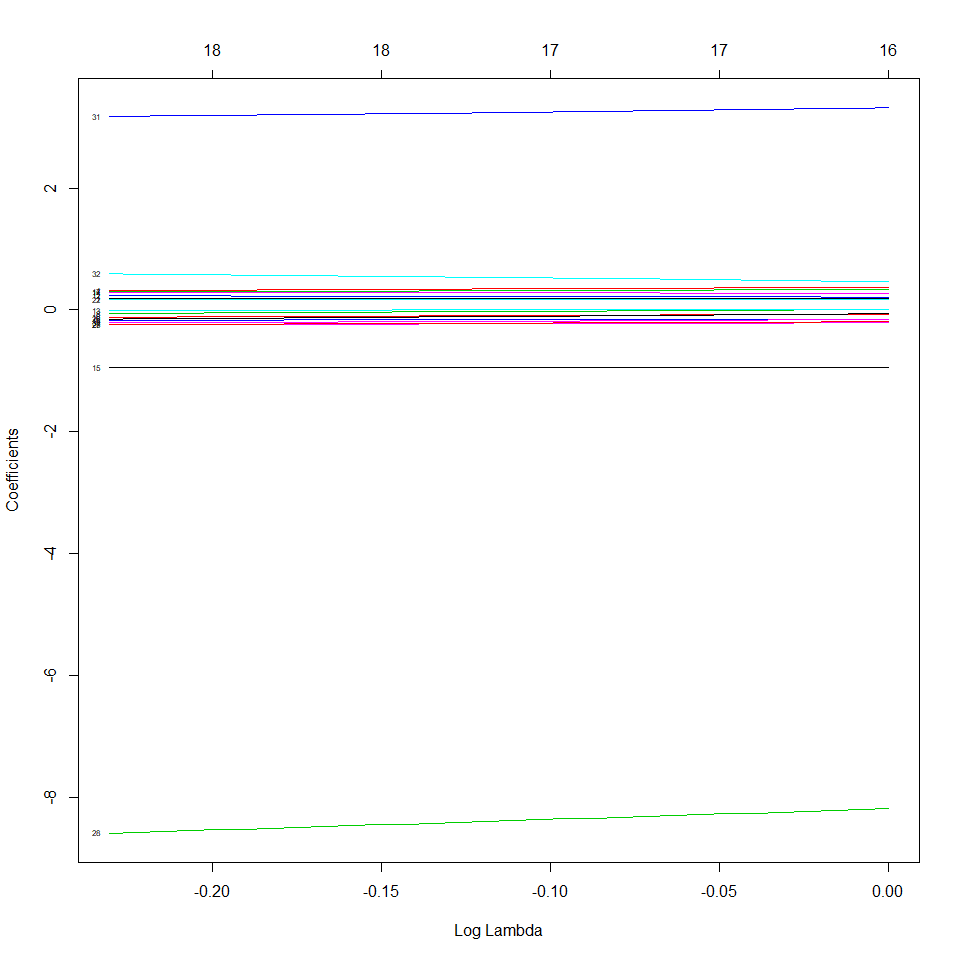
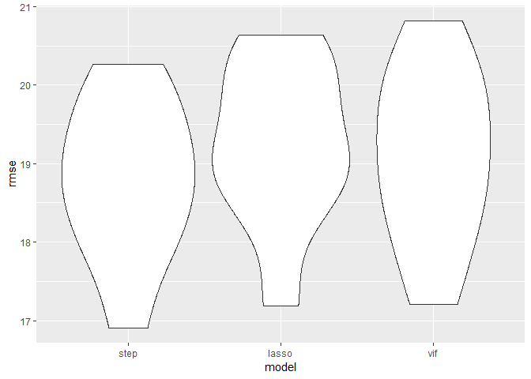

lasso\_model
================

``` r
death_data_full = read_csv("data/Cancer_Registry.csv") %>%
    janitor::clean_names() %>%
    mutate(median_age = ifelse(median_age >60, NA, median_age)) %>%
    separate(geography, into = c("county", "state"), sep = ", ") %>%
    mutate(study_per_cap = ifelse(study_per_cap == 0,0,1)) %>%
    mutate(race_other = pct_other_race + pct_asian) %>%
    mutate(state = ifelse(state == "District of Columbia", "DC", state.abb[match(state, state.name)])) %>% 
    mutate(region_w = ifelse(state == "WA" | state == "MT" | state == "ID" | state == "OR" | state == "WY" | state == "NV" | state == "UT" | state == "CO" | state == "CA", 1, 0),
           region_sw = ifelse(state == "AZ" | state == "NM" | state == "TX" | state == "OK", 1, 0),
           region_me = ifelse(state == "ND" | state == "SD" | state == "NE" | state == "KS" | state == "MN" | state == "IA" | state == "MO" | state == "WI" | state == "IL" | state == "MI" | state == "IN" | state == "OH", 1, 0),
           region_se = ifelse(state == "AR" | state == "LA" | state == "MS" | state == "AL" | state == "GA" | state == "FL" | state == "SC" | state == "NC" | state == "TN" | state == "KY" | state == "VA" | state == "WV" | state == "MD" | state == "DC" , 1, 0)) %>% 
   unite(geography,c(county, state), sep = ", ")
```

    ## Parsed with column specification:
    ## cols(
    ##   .default = col_double(),
    ##   avgDeathsPerYear = col_integer(),
    ##   medIncome = col_integer(),
    ##   popEst2015 = col_integer(),
    ##   binnedInc = col_character(),
    ##   Geography = col_character()
    ## )

    ## See spec(...) for full column specifications.

``` r
sex_data = read_csv("./data/SEX01.csv") %>% 
  dplyr::select(Areaname,SEX255209D) %>% 
  separate(Areaname, c("county","state"), sep = ", ") %>% 
  na.omit() %>% 
  mutate(county = paste(county,"County", sep = " "),
         sex_ratio = SEX255209D) %>% 
  unite(geography,c(county, state), sep = ", ") %>% 
  dplyr::select(geography,sex_ratio)
```

    ## Parsed with column specification:
    ## cols(
    ##   .default = col_character(),
    ##   SEX255203F = col_integer(),
    ##   SEX255203D = col_double(),
    ##   SEX255204F = col_integer(),
    ##   SEX255204D = col_double(),
    ##   SEX255205F = col_integer(),
    ##   SEX255205D = col_double(),
    ##   SEX255206F = col_integer(),
    ##   SEX255206D = col_double(),
    ##   SEX255207F = col_integer(),
    ##   SEX255207D = col_double(),
    ##   SEX255208F = col_integer(),
    ##   SEX255208D = col_double(),
    ##   SEX255209F = col_integer(),
    ##   SEX255209D = col_double(),
    ##   SEX300200F = col_integer(),
    ##   SEX300200D = col_double(),
    ##   SEX300210F = col_integer(),
    ##   SEX300210D = col_double(),
    ##   SEX320200F = col_integer(),
    ##   SEX320200D = col_double()
    ## )
    ## See spec(...) for full column specifications.

    ## Warning: Expected 2 pieces. Missing pieces filled with `NA` in 53 rows [1,
    ## 2, 70, 100, 116, 192, 251, 316, 325, 329, 330, 331, 399, 559, 565, 610,
    ## 713, 806, 906, 1012, ...].

``` r
age_data=read_csv("./data/AGE04.csv") %>% 
  dplyr::select(Areaname,AGE775208D) %>% 
  separate(Areaname, c("county","state"), sep = ", ") %>% 
  na.omit() %>% 
  mutate(county = paste(county,"County", sep = " "),
         pct_aging = AGE775208D) %>% 
  unite(geography,c(county, state), sep = ", ") %>% 
  dplyr::select(geography,pct_aging)
```

    ## Parsed with column specification:
    ## cols(
    ##   .default = col_character(),
    ##   AGE770209F = col_integer(),
    ##   AGE770209D = col_integer(),
    ##   AGE775200F = col_integer(),
    ##   AGE775200D = col_double(),
    ##   AGE775201F = col_integer(),
    ##   AGE775201D = col_double(),
    ##   AGE775202F = col_integer(),
    ##   AGE775202D = col_double(),
    ##   AGE775203F = col_integer(),
    ##   AGE775203D = col_double(),
    ##   AGE775204F = col_integer(),
    ##   AGE775204D = col_double(),
    ##   AGE775205F = col_integer(),
    ##   AGE775205D = col_double(),
    ##   AGE775206F = col_integer(),
    ##   AGE775206D = col_double(),
    ##   AGE775207F = col_integer(),
    ##   AGE775207D = col_double(),
    ##   AGE775208F = col_integer(),
    ##   AGE775208D = col_double()
    ## )
    ## See spec(...) for full column specifications.

    ## Warning: Expected 2 pieces. Missing pieces filled with `NA` in 53 rows [1,
    ## 2, 70, 100, 116, 192, 251, 316, 325, 329, 330, 331, 399, 559, 565, 610,
    ## 713, 806, 906, 1012, ...].

``` r
cancer_1 = left_join(death_data_full,sex_data,by = "geography")
death_data_full = left_join(cancer_1,age_data,by = "geography") 

death_data_full = death_data_full %>% 
  separate(geography, c("county","state"), sep = ", ")

death_data =
  death_data_full %>%
  janitor::clean_names() %>%
  dplyr::select(-c(avg_ann_count,avg_deaths_per_year, pct_some_col18_24, binned_inc, county, pct_asian, pct_other_race,state)) %>% 
  mutate(sex_ratio = replace_na(sex_ratio,50.2), pct_aging = replace_na(pct_aging,15.58), pct_private_coverage_alone = replace_na(pct_private_coverage_alone,48.48), pct_employed16_over = replace_na(pct_employed16_over,48.48), median_age = replace_na(median_age,40.82))
```

``` r
d = death_data

cancer_x = d %>%
  dplyr::select(- target_death_rate)

predictor = as.matrix(cancer_x)

target = as.matrix(d$target_death_rate)

grid <- 10^seq(-0.1,0, length = 30)

train<-sample(1:3059,2753)

test<-(-train)

cv.out<-cv.glmnet(predictor[train,],target[train])
plot(cv.out)
```


``` r
best.lambda<-cv.out$lambda.min

lasso <- cv.glmnet(predictor, target, standardize = TRUE, lambda = grid)

best.lambda<-cv.out$lambda.min

plot(lasso$glmnet.fit, "lambda", label=TRUE)
```



``` r
colnames(predictor)
```

    ##  [1] "incidence_rate"             "med_income"                
    ##  [3] "pop_est2015"                "poverty_percent"           
    ##  [5] "study_per_cap"              "median_age"                
    ##  [7] "median_age_male"            "median_age_female"         
    ##  [9] "avg_household_size"         "percent_married"           
    ## [11] "pct_no_hs18_24"             "pct_hs18_24"               
    ## [13] "pct_bach_deg18_24"          "pct_hs25_over"             
    ## [15] "pct_bach_deg25_over"        "pct_employed16_over"       
    ## [17] "pct_unemployed16_over"      "pct_private_coverage"      
    ## [19] "pct_private_coverage_alone" "pct_emp_priv_coverage"     
    ## [21] "pct_public_coverage"        "pct_public_coverage_alone" 
    ## [23] "pct_white"                  "pct_black"                 
    ## [25] "pct_married_households"     "birth_rate"                
    ## [27] "race_other"                 "region_w"                  
    ## [29] "region_sw"                  "region_me"                 
    ## [31] "region_se"                  "sex_ratio"                 
    ## [33] "pct_aging"

``` r
fit = lm(target_death_rate ~ pct_bach_deg25_over + incidence_rate + region_w + pct_hs18_24 + pct_hs25_over + pct_unemployed16_over + poverty_percent + region_se + pct_married_households + sex_ratio + race_other + pct_private_coverage, data = d)

summary(fit)
```

    ## 
    ## Call:
    ## lm(formula = target_death_rate ~ pct_bach_deg25_over + incidence_rate + 
    ##     region_w + pct_hs18_24 + pct_hs25_over + pct_unemployed16_over + 
    ##     poverty_percent + region_se + pct_married_households + sex_ratio + 
    ##     race_other + pct_private_coverage, data = d)
    ## 
    ## Residuals:
    ##      Min       1Q   Median       3Q      Max 
    ## -102.923  -11.035   -0.068   10.917  134.097 
    ## 
    ## Coefficients:
    ##                          Estimate Std. Error t value Pr(>|t|)    
    ## (Intercept)             69.761287  14.047138   4.966 7.20e-07 ***
    ## pct_bach_deg25_over     -0.905183   0.134860  -6.712 2.28e-11 ***
    ## incidence_rate           0.192406   0.006999  27.490  < 2e-16 ***
    ## region_w               -10.058681   1.251145  -8.040 1.28e-15 ***
    ## pct_hs18_24              0.302379   0.046020   6.571 5.87e-11 ***
    ## pct_hs25_over            0.308481   0.091859   3.358 0.000794 ***
    ## pct_unemployed16_over    0.541367   0.144814   3.738 0.000189 ***
    ## poverty_percent          0.406597   0.122356   3.323 0.000901 ***
    ## region_se                3.824521   0.871237   4.390 1.17e-05 ***
    ## pct_married_households  -0.296819   0.074759  -3.970 7.34e-05 ***
    ## sex_ratio                0.718937   0.179982   3.994 6.64e-05 ***
    ## race_other              -0.307665   0.084318  -3.649 0.000268 ***
    ## pct_private_coverage    -0.277325   0.070882  -3.912 9.33e-05 ***
    ## ---
    ## Signif. codes:  0 '***' 0.001 '**' 0.01 '*' 0.05 '.' 0.1 ' ' 1
    ## 
    ## Residual standard error: 19.3 on 3046 degrees of freedom
    ## Multiple R-squared:  0.5186, Adjusted R-squared:  0.5167 
    ## F-statistic: 273.5 on 12 and 3046 DF,  p-value: < 2.2e-16

``` r
set.seed(1)
data_train = trainControl(method = "cv", number = 10)

vif_reg = lm(target_death_rate ~ incidence_rate +
                      median_age_female+
                      poverty_percent+
                      avg_household_size + percent_married +
                      pct_employed16_over+
                      pct_bach_deg18_24 + pct_hs25_over +
                      pct_unemployed16_over + 
                      pct_public_coverage_alone + 
                      pct_black + pct_married_households + birth_rate +
                      race_other + region_w + region_sw + region_me +
                      region_se + sex_ratio+pct_aging, data =
                      d)

lasso_reg = lm(target_death_rate ~ pct_bach_deg25_over + incidence_rate +
region_w + pct_hs18_24 + pct_hs25_over + pct_unemployed16_over + poverty_percent + region_se +
 pct_married_households + sex_ratio + race_other + pct_private_coverage, data =
                      d)
  
step_reg = lm(target_death_rate ~ incidence_rate + med_income + poverty_percent  + median_age_male + percent_married +
pct_hs18_24 + pct_hs25_over + pct_bach_deg25_over + pct_employed16_over + pct_unemployed16_over  +
pct_private_coverage + pct_emp_priv_coverage + pct_white + pct_black + pct_married_households +
birth_rate  + race_other + region_w + region_sw + region_me + region_se + sex_ratio + pct_aging, data =
                      d)

cv_df =
  crossv_kfold(death_data, k=10) %>% 
  mutate(train = map(train, as_tibble),
         test = map(test, as_tibble))

cv_df = 
  cv_df %>% 
  mutate(step_mod = map(train, ~step_reg),
         lasso_mod = map(train, ~lasso_reg),
         vif_mod = map(train, ~vif_reg)) %>% 
  mutate(rmse_step    = map2_dbl(step_mod, test, ~rmse(model = .x, data = .y)),
         rmse_lasso = map2_dbl(lasso_mod, test, ~rmse(model = .x, data = .y)),
         rmse_vif = map2_dbl(vif_mod, test, ~rmse(model = .x, data = .y)))
  
cv_df %>% 
  dplyr::select(starts_with("rmse")) %>% 
  gather(key = model, value = rmse) %>% 
  mutate(model = str_replace(model, "rmse_", ""),
         model = fct_inorder(model)) %>% 
  ggplot(aes(x = model, y = rmse)) + geom_violin()
```


