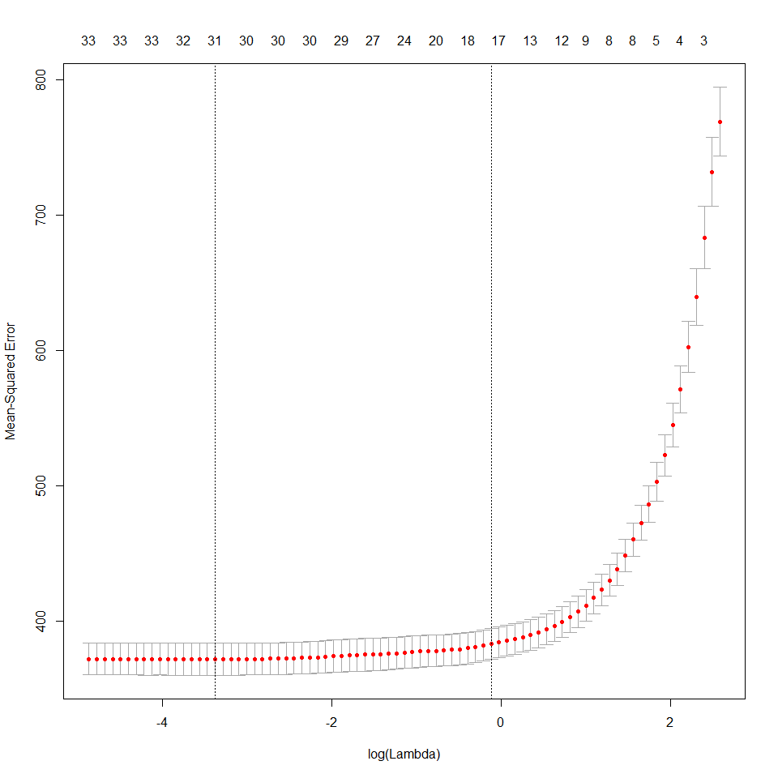

lasso\_model
================

``` r
cancer_data = read.csv(file = "data/Cancer_Registry.csv")
```

missing data:

PctSomeCol18\_24

PctOtherRace

PctEmployed16\_Over

studyPerCap

PctPrivateCoverageAlone

binnedInc

``` r
cancer_data = cancer_data %>%
  select(-PctSomeCol18_24, -PctOtherRace, -PctEmployed16_Over, -studyPerCap,
         -PctPrivateCoverageAlone, -binnedInc, -Geography)

round(cor(cancer_data),3)
```

    ##                        avgAnnCount avgDeathsPerYear TARGET_deathRate
    ## avgAnnCount                  1.000            0.939           -0.144
    ## avgDeathsPerYear             0.939            1.000           -0.091
    ## TARGET_deathRate            -0.144           -0.091            1.000
    ## incidenceRate                0.074            0.063            0.449
    ## medIncome                    0.269            0.223           -0.429
    ## popEst2015                   0.927            0.978           -0.120
    ## povertyPercent              -0.136           -0.067            0.429
    ## MedianAge                   -0.024           -0.025            0.004
    ## MedianAgeMale               -0.125           -0.148           -0.022
    ## MedianAgeFemale             -0.123           -0.144            0.012
    ## AvgHouseholdSize             0.065            0.086           -0.037
    ## PercentMarried              -0.106           -0.181           -0.267
    ## PctNoHS18_24                -0.143           -0.137            0.088
    ## PctHS18_24                  -0.182           -0.151            0.262
    ## PctBachDeg18_24              0.284            0.260           -0.288
    ## PctHS25_Over                -0.311           -0.296            0.405
    ## PctBachDeg25_Over            0.321            0.293           -0.485
    ## PctUnemployed16_Over        -0.009            0.070            0.378
    ## PctPrivateCoverage           0.132            0.056           -0.386
    ## PctEmpPrivCoverage           0.202            0.160           -0.267
    ## PctPublicCoverage           -0.174           -0.132            0.405
    ## PctPublicCoverageAlone      -0.094           -0.027            0.449
    ## PctWhite                    -0.137           -0.187           -0.177
    ## PctBlack                     0.031            0.085            0.257
    ## PctAsian                     0.435            0.443           -0.186
    ## PctMarriedHouseholds        -0.106           -0.160           -0.293
    ## BirthRate                   -0.035           -0.074           -0.087
    ##                        incidenceRate medIncome popEst2015 povertyPercent
    ## avgAnnCount                    0.074     0.269      0.927         -0.136
    ## avgDeathsPerYear               0.063     0.223      0.978         -0.067
    ## TARGET_deathRate               0.449    -0.429     -0.120          0.429
    ## incidenceRate                  1.000    -0.001      0.027          0.009
    ## medIncome                     -0.001     1.000      0.236         -0.789
    ## popEst2015                     0.027     0.236      1.000         -0.065
    ## povertyPercent                 0.009    -0.789     -0.065          1.000
    ## MedianAge                      0.018    -0.013     -0.025         -0.029
    ## MedianAgeMale                 -0.015    -0.092     -0.177         -0.214
    ## MedianAgeFemale               -0.009    -0.153     -0.178         -0.148
    ## AvgHouseholdSize              -0.118     0.112      0.110          0.074
    ## PercentMarried                -0.120     0.355     -0.160         -0.643
    ## PctNoHS18_24                  -0.171    -0.289     -0.127          0.288
    ## PctHS18_24                     0.023    -0.190     -0.152          0.094
    ## PctBachDeg18_24                0.047     0.493      0.248         -0.387
    ## PctHS25_Over                   0.122    -0.471     -0.312          0.194
    ## PctBachDeg25_Over             -0.038     0.705      0.297         -0.532
    ## PctUnemployed16_Over           0.100    -0.453      0.051          0.655
    ## PctPrivateCoverage             0.105     0.724      0.053         -0.823
    ## PctEmpPrivCoverage             0.150     0.747      0.159         -0.683
    ## PctPublicCoverage              0.046    -0.755     -0.160          0.651
    ## PctPublicCoverageAlone         0.041    -0.720     -0.041          0.799
    ## PctWhite                      -0.015     0.167     -0.190         -0.509
    ## PctBlack                       0.113    -0.270      0.073          0.512
    ## PctAsian                      -0.008     0.426      0.464         -0.157
    ## PctMarriedHouseholds          -0.152     0.446     -0.128         -0.605
    ## BirthRate                     -0.118    -0.010     -0.058         -0.012
    ##                        MedianAge MedianAgeMale MedianAgeFemale
    ## avgAnnCount               -0.024        -0.125          -0.123
    ## avgDeathsPerYear          -0.025        -0.148          -0.144
    ## TARGET_deathRate           0.004        -0.022           0.012
    ## incidenceRate              0.018        -0.015          -0.009
    ## medIncome                 -0.013        -0.092          -0.153
    ## popEst2015                -0.025        -0.177          -0.178
    ## povertyPercent            -0.029        -0.214          -0.148
    ## MedianAge                  1.000         0.129           0.125
    ## MedianAgeMale              0.129         1.000           0.934
    ## MedianAgeFemale            0.125         0.934           1.000
    ## AvgHouseholdSize          -0.032        -0.343          -0.368
    ## PercentMarried             0.046         0.450           0.375
    ## PctNoHS18_24               0.006         0.100           0.136
    ## PctHS18_24                 0.051         0.241           0.243
    ## PctBachDeg18_24           -0.017        -0.034          -0.071
    ## PctHS25_Over               0.037         0.318           0.345
    ## PctBachDeg25_Over         -0.020        -0.132          -0.181
    ## PctUnemployed16_Over       0.019        -0.143          -0.111
    ## PctPrivateCoverage         0.005         0.082           0.047
    ## PctEmpPrivCoverage        -0.037        -0.209          -0.252
    ## PctPublicCoverage          0.049         0.399           0.455
    ## PctPublicCoverageAlone    -0.003         0.002           0.048
    ## PctWhite                   0.035         0.398           0.340
    ## PctBlack                  -0.017        -0.243          -0.157
    ## PctAsian                  -0.038        -0.238          -0.259
    ## PctMarriedHouseholds       0.015         0.222           0.162
    ## BirthRate                 -0.008        -0.104          -0.099
    ##                        AvgHouseholdSize PercentMarried PctNoHS18_24
    ## avgAnnCount                       0.065         -0.106       -0.143
    ## avgDeathsPerYear                  0.086         -0.181       -0.137
    ## TARGET_deathRate                 -0.037         -0.267        0.088
    ## incidenceRate                    -0.118         -0.120       -0.171
    ## medIncome                         0.112          0.355       -0.289
    ## popEst2015                        0.110         -0.160       -0.127
    ## povertyPercent                    0.074         -0.643        0.288
    ## MedianAge                        -0.032          0.046        0.006
    ## MedianAgeMale                    -0.343          0.450        0.100
    ## MedianAgeFemale                  -0.368          0.375        0.136
    ## AvgHouseholdSize                  1.000         -0.101        0.065
    ## PercentMarried                   -0.101          1.000       -0.012
    ## PctNoHS18_24                      0.065         -0.012        1.000
    ## PctHS18_24                        0.027          0.133        0.085
    ## PctBachDeg18_24                  -0.061          0.053       -0.381
    ## PctHS25_Over                     -0.139          0.102        0.217
    ## PctBachDeg25_Over                 0.014          0.104       -0.397
    ## PctUnemployed16_Over              0.132         -0.551        0.181
    ## PctPrivateCoverage               -0.144          0.449       -0.455
    ## PctEmpPrivCoverage                0.011          0.233       -0.430
    ## PctPublicCoverage                -0.135         -0.247        0.319
    ## PctPublicCoverageAlone            0.061         -0.460        0.327
    ## PctWhite                         -0.188          0.677       -0.157
    ## PctBlack                          0.030         -0.622        0.117
    ## PctAsian                          0.132         -0.149       -0.218
    ## PctMarriedHouseholds              0.091          0.870        0.005
    ## BirthRate                         0.076          0.141        0.126
    ##                        PctHS18_24 PctBachDeg18_24 PctHS25_Over
    ## avgAnnCount                -0.182           0.284       -0.311
    ## avgDeathsPerYear           -0.151           0.260       -0.296
    ## TARGET_deathRate            0.262          -0.288        0.405
    ## incidenceRate               0.023           0.047        0.122
    ## medIncome                  -0.190           0.493       -0.471
    ## popEst2015                 -0.152           0.248       -0.312
    ## povertyPercent              0.094          -0.387        0.194
    ## MedianAge                   0.051          -0.017        0.037
    ## MedianAgeMale               0.241          -0.034        0.318
    ## MedianAgeFemale             0.243          -0.071        0.345
    ## AvgHouseholdSize            0.027          -0.061       -0.139
    ## PercentMarried              0.133           0.053        0.102
    ## PctNoHS18_24                0.085          -0.381        0.217
    ## PctHS18_24                  1.000          -0.389        0.439
    ## PctBachDeg18_24            -0.389           1.000       -0.384
    ## PctHS25_Over                0.439          -0.384        1.000
    ## PctBachDeg25_Over          -0.405           0.600       -0.741
    ## PctUnemployed16_Over        0.131          -0.309        0.082
    ## PctPrivateCoverage         -0.254           0.488       -0.222
    ## PctEmpPrivCoverage         -0.244           0.451       -0.223
    ## PctPublicCoverage           0.278          -0.422        0.428
    ## PctPublicCoverageAlone      0.234          -0.422        0.297
    ## PctWhite                    0.045           0.069        0.188
    ## PctBlack                   -0.025          -0.094       -0.024
    ## PctAsian                   -0.200           0.346       -0.437
    ## PctMarriedHouseholds        0.120           0.000        0.062
    ## BirthRate                   0.058          -0.125        0.017
    ##                        PctBachDeg25_Over PctUnemployed16_Over
    ## avgAnnCount                        0.321               -0.009
    ## avgDeathsPerYear                   0.293                0.070
    ## TARGET_deathRate                  -0.485                0.378
    ## incidenceRate                     -0.038                0.100
    ## medIncome                          0.705               -0.453
    ## popEst2015                         0.297                0.051
    ## povertyPercent                    -0.532                0.655
    ## MedianAge                         -0.020                0.019
    ## MedianAgeMale                     -0.132               -0.143
    ## MedianAgeFemale                   -0.181               -0.111
    ## AvgHouseholdSize                   0.014                0.132
    ## PercentMarried                     0.104               -0.551
    ## PctNoHS18_24                      -0.397                0.181
    ## PctHS18_24                        -0.405                0.131
    ## PctBachDeg18_24                    0.600               -0.309
    ## PctHS25_Over                      -0.741                0.082
    ## PctBachDeg25_Over                  1.000               -0.373
    ## PctUnemployed16_Over              -0.373                1.000
    ## PctPrivateCoverage                 0.603               -0.634
    ## PctEmpPrivCoverage                 0.539               -0.475
    ## PctPublicCoverage                 -0.636                0.530
    ## PctPublicCoverageAlone            -0.606                0.655
    ## PctWhite                           0.049               -0.502
    ## PctBlack                          -0.146                0.469
    ## PctAsian                           0.438               -0.022
    ## PctMarriedHouseholds               0.098               -0.470
    ## BirthRate                         -0.088               -0.068
    ##                        PctPrivateCoverage PctEmpPrivCoverage
    ## avgAnnCount                         0.132              0.202
    ## avgDeathsPerYear                    0.056              0.160
    ## TARGET_deathRate                   -0.386             -0.267
    ## incidenceRate                       0.105              0.150
    ## medIncome                           0.724              0.747
    ## popEst2015                          0.053              0.159
    ## povertyPercent                     -0.823             -0.683
    ## MedianAge                           0.005             -0.037
    ## MedianAgeMale                       0.082             -0.209
    ## MedianAgeFemale                     0.047             -0.252
    ## AvgHouseholdSize                   -0.144              0.011
    ## PercentMarried                      0.449              0.233
    ## PctNoHS18_24                       -0.455             -0.430
    ## PctHS18_24                         -0.254             -0.244
    ## PctBachDeg18_24                     0.488              0.451
    ## PctHS25_Over                       -0.222             -0.223
    ## PctBachDeg25_Over                   0.603              0.539
    ## PctUnemployed16_Over               -0.634             -0.475
    ## PctPrivateCoverage                  1.000              0.827
    ## PctEmpPrivCoverage                  0.827              1.000
    ## PctPublicCoverage                  -0.720             -0.778
    ## PctPublicCoverageAlone             -0.886             -0.729
    ## PctWhite                            0.429              0.270
    ## PctBlack                           -0.345             -0.237
    ## PctAsian                            0.189              0.282
    ## PctMarriedHouseholds                0.435              0.323
    ## BirthRate                          -0.040             -0.094
    ##                        PctPublicCoverage PctPublicCoverageAlone PctWhite
    ## avgAnnCount                       -0.174                 -0.094   -0.137
    ## avgDeathsPerYear                  -0.132                 -0.027   -0.187
    ## TARGET_deathRate                   0.405                  0.449   -0.177
    ## incidenceRate                      0.046                  0.041   -0.015
    ## medIncome                         -0.755                 -0.720    0.167
    ## popEst2015                        -0.160                 -0.041   -0.190
    ## povertyPercent                     0.651                  0.799   -0.509
    ## MedianAge                          0.049                 -0.003    0.035
    ## MedianAgeMale                      0.399                  0.002    0.398
    ## MedianAgeFemale                    0.455                  0.048    0.340
    ## AvgHouseholdSize                  -0.135                  0.061   -0.188
    ## PercentMarried                    -0.247                 -0.460    0.677
    ## PctNoHS18_24                       0.319                  0.327   -0.157
    ## PctHS18_24                         0.278                  0.234    0.045
    ## PctBachDeg18_24                   -0.422                 -0.422    0.069
    ## PctHS25_Over                       0.428                  0.297    0.188
    ## PctBachDeg25_Over                 -0.636                 -0.606    0.049
    ## PctUnemployed16_Over               0.530                  0.655   -0.502
    ## PctPrivateCoverage                -0.720                 -0.886    0.429
    ## PctEmpPrivCoverage                -0.778                 -0.729    0.270
    ## PctPublicCoverage                  1.000                  0.866   -0.134
    ## PctPublicCoverageAlone             0.866                  1.000   -0.361
    ## PctWhite                          -0.134                 -0.361    1.000
    ## PctBlack                           0.196                  0.330   -0.828
    ## PctAsian                          -0.306                 -0.181   -0.266
    ## PctMarriedHouseholds              -0.362                 -0.474    0.597
    ## BirthRate                         -0.031                 -0.005   -0.009
    ##                        PctBlack PctAsian PctMarriedHouseholds BirthRate
    ## avgAnnCount               0.031    0.435               -0.106    -0.035
    ## avgDeathsPerYear          0.085    0.443               -0.160    -0.074
    ## TARGET_deathRate          0.257   -0.186               -0.293    -0.087
    ## incidenceRate             0.113   -0.008               -0.152    -0.118
    ## medIncome                -0.270    0.426                0.446    -0.010
    ## popEst2015                0.073    0.464               -0.128    -0.058
    ## povertyPercent            0.512   -0.157               -0.605    -0.012
    ## MedianAge                -0.017   -0.038                0.015    -0.008
    ## MedianAgeMale            -0.243   -0.238                0.222    -0.104
    ## MedianAgeFemale          -0.157   -0.259                0.162    -0.099
    ## AvgHouseholdSize          0.030    0.132                0.091     0.076
    ## PercentMarried           -0.622   -0.149                0.870     0.141
    ## PctNoHS18_24              0.117   -0.218                0.005     0.126
    ## PctHS18_24               -0.025   -0.200                0.120     0.058
    ## PctBachDeg18_24          -0.094    0.346                0.000    -0.125
    ## PctHS25_Over             -0.024   -0.437                0.062     0.017
    ## PctBachDeg25_Over        -0.146    0.438                0.098    -0.088
    ## PctUnemployed16_Over      0.469   -0.022               -0.470    -0.068
    ## PctPrivateCoverage       -0.345    0.189                0.435    -0.040
    ## PctEmpPrivCoverage       -0.237    0.282                0.323    -0.094
    ## PctPublicCoverage         0.196   -0.306               -0.362    -0.031
    ## PctPublicCoverageAlone    0.330   -0.181               -0.474    -0.005
    ## PctWhite                 -0.828   -0.266                0.597    -0.009
    ## PctBlack                  1.000    0.017               -0.574    -0.068
    ## PctAsian                  0.017    1.000               -0.087    -0.062
    ## PctMarriedHouseholds     -0.574   -0.087                1.000     0.102
    ## BirthRate                -0.068   -0.062                0.102     1.000

collinearity:

avgAnnCount avgDeathsPerYear popEst2015

medIncome povertyPercent PctPrivateCoverage PctEmpPrivCoverage PctPublicCoverage PctPublicCoverageAlone

medIncome PctBachDeg25\_Over

MedianAgeMale MedianAgeFemale

PercentMarried PctMarriedHouseholds

PctHS25\_Over PctBachDeg25\_Over

PctWhite PctBlack

``` r
cancer_x = cancer_data %>%
  select(-TARGET_deathRate)

predictor = as.matrix(cancer_x)

target = as.matrix(cancer_data$TARGET_deathRate)

grid <- 10^seq(2,-2, length=10)

lasso <- cv.glmnet(predictor, target, standardize = TRUE)

plot(lasso$glmnet.fit, "lambda", label=TRUE)
```



``` r
str(cancer_x)
```

    ## 'data.frame':    3047 obs. of  26 variables:
    ##  $ avgAnnCount           : num  1397 173 102 427 57 ...
    ##  $ avgDeathsPerYear      : int  469 70 50 202 26 152 97 71 36 1380 ...
    ##  $ incidenceRate         : num  490 412 350 430 350 ...
    ##  $ medIncome             : int  61898 48127 49348 44243 49955 52313 37782 40189 42579 60397 ...
    ##  $ popEst2015            : int  260131 43269 21026 75882 10321 61023 41516 20848 13088 843954 ...
    ##  $ povertyPercent        : num  11.2 18.6 14.6 17.1 12.5 15.6 23.2 17.8 22.3 13.1 ...
    ##  $ MedianAge             : num  39.3 33 45 42.8 48.3 45.4 42.6 51.7 49.3 35.8 ...
    ##  $ MedianAgeMale         : num  36.9 32.2 44 42.2 47.8 43.5 42.2 50.8 48.4 34.7 ...
    ##  $ MedianAgeFemale       : num  41.7 33.7 45.8 43.4 48.9 48 43.5 52.5 49.8 37 ...
    ##  $ AvgHouseholdSize      : num  2.54 2.34 2.62 2.52 2.34 2.58 2.42 2.24 2.38 2.65 ...
    ##  $ PercentMarried        : num  52.5 44.5 54.2 52.7 57.8 50.4 54.1 52.7 55.9 50 ...
    ##  $ PctNoHS18_24          : num  11.5 6.1 24 20.2 14.9 29.9 26.1 27.3 34.7 15.6 ...
    ##  $ PctHS18_24            : num  39.5 22.4 36.6 41.2 43 35.1 41.4 33.9 39.4 36.3 ...
    ##  $ PctBachDeg18_24       : num  6.9 7.5 9.5 2.5 2 4.5 5.8 2.2 1.4 7.1 ...
    ##  $ PctHS25_Over          : num  23.2 26 29 31.6 33.4 30.4 29.8 31.6 32.2 28.8 ...
    ##  $ PctBachDeg25_Over     : num  19.6 22.7 16 9.3 15 11.9 11.9 11.3 12 16.2 ...
    ##  $ PctUnemployed16_Over  : num  8 7.8 7 12.1 4.8 12.9 8.9 8.9 10.3 9.2 ...
    ##  $ PctPrivateCoverage    : num  75.1 70.2 63.7 58.4 61.6 60 49.5 55.8 55.5 69.9 ...
    ##  $ PctEmpPrivCoverage    : num  41.6 43.6 34.9 35 35.1 32.6 28.3 25.9 29.9 44.4 ...
    ##  $ PctPublicCoverage     : num  32.9 31.1 42.1 45.3 44 43.2 46.4 50.9 48.1 31.4 ...
    ##  $ PctPublicCoverageAlone: num  14 15.3 21.1 25 22.7 20.2 28.7 24.1 26.6 16.5 ...
    ##  $ PctWhite              : num  81.8 89.2 90.9 91.7 94.1 ...
    ##  $ PctBlack              : num  2.595 0.969 0.74 0.783 0.27 ...
    ##  $ PctAsian              : num  4.822 2.246 0.466 1.161 0.666 ...
    ##  $ PctMarriedHouseholds  : num  52.9 45.4 54.4 51 54 ...
    ##  $ BirthRate             : num  6.12 4.33 3.73 4.6 6.8 ...

``` r
colnames(cancer_x)
```

    ##  [1] "avgAnnCount"            "avgDeathsPerYear"      
    ##  [3] "incidenceRate"          "medIncome"             
    ##  [5] "popEst2015"             "povertyPercent"        
    ##  [7] "MedianAge"              "MedianAgeMale"         
    ##  [9] "MedianAgeFemale"        "AvgHouseholdSize"      
    ## [11] "PercentMarried"         "PctNoHS18_24"          
    ## [13] "PctHS18_24"             "PctBachDeg18_24"       
    ## [15] "PctHS25_Over"           "PctBachDeg25_Over"     
    ## [17] "PctUnemployed16_Over"   "PctPrivateCoverage"    
    ## [19] "PctEmpPrivCoverage"     "PctPublicCoverage"     
    ## [21] "PctPublicCoverageAlone" "PctWhite"              
    ## [23] "PctBlack"               "PctAsian"              
    ## [25] "PctMarriedHouseholds"   "BirthRate"

16, 21, 3, 6, 15, 17, 13, 25, 18, 23

PctBachDeg25\_Over, PctPublicCoverageAlone, incidenceRate, povertyPercent, PctHS25\_Over, PctUnemployed16\_Over, PctHS18\_24, PctMarriedHouseholds, PctPrivateCoverage, PctBlack

``` r
fit_1 = lm(TARGET_deathRate ~ PctBachDeg25_Over + PctPublicCoverageAlone + incidenceRate + povertyPercent + PctHS25_Over + PctUnemployed16_Over + PctHS18_24 + PctMarriedHouseholds + PctPrivateCoverage + PctBlack, data = cancer_data)

summary(fit_1)
```

    ## 
    ## Call:
    ## lm(formula = TARGET_deathRate ~ PctBachDeg25_Over + PctPublicCoverageAlone + 
    ##     incidenceRate + povertyPercent + PctHS25_Over + PctUnemployed16_Over + 
    ##     PctHS18_24 + PctMarriedHouseholds + PctPrivateCoverage + 
    ##     PctBlack, data = cancer_data)
    ## 
    ## Residuals:
    ##      Min       1Q   Median       3Q      Max 
    ## -107.299  -11.456    0.117   11.382  141.778 
    ## 
    ## Coefficients:
    ##                        Estimate Std. Error t value Pr(>|t|)    
    ## (Intercept)            81.89738   10.66060   7.682 2.09e-14 ***
    ## PctBachDeg25_Over      -0.90727    0.13829  -6.561 6.27e-11 ***
    ## PctPublicCoverageAlone  0.05341    0.14400   0.371 0.710740    
    ## incidenceRate           0.20786    0.00718  28.948  < 2e-16 ***
    ## povertyPercent          0.55583    0.12352   4.500 7.05e-06 ***
    ## PctHS25_Over            0.55832    0.08873   6.292 3.58e-10 ***
    ## PctUnemployed16_Over    0.53326    0.15236   3.500 0.000472 ***
    ## PctHS18_24              0.26736    0.04674   5.720 1.17e-08 ***
    ## PctMarriedHouseholds   -0.31801    0.08085  -3.933 8.57e-05 ***
    ## PctPrivateCoverage     -0.18391    0.09068  -2.028 0.042640 *  
    ## PctBlack                0.04243    0.03260   1.301 0.193189    
    ## ---
    ## Signif. codes:  0 '***' 0.001 '**' 0.01 '*' 0.05 '.' 0.1 ' ' 1
    ## 
    ## Residual standard error: 19.85 on 3036 degrees of freedom
    ## Multiple R-squared:   0.49,  Adjusted R-squared:  0.4883 
    ## F-statistic: 291.7 on 10 and 3036 DF,  p-value: < 2.2e-16

``` r
fit_2 = lm(TARGET_deathRate ~ PctBachDeg25_Over + incidenceRate + povertyPercent + PctHS25_Over + PctUnemployed16_Over + PctHS18_24 + PctMarriedHouseholds + PctPrivateCoverage + PctBlack, data = cancer_data)

summary(fit_2)
```

    ## 
    ## Call:
    ## lm(formula = TARGET_deathRate ~ PctBachDeg25_Over + incidenceRate + 
    ##     povertyPercent + PctHS25_Over + PctUnemployed16_Over + PctHS18_24 + 
    ##     PctMarriedHouseholds + PctPrivateCoverage + PctBlack, data = cancer_data)
    ## 
    ## Residuals:
    ##      Min       1Q   Median       3Q      Max 
    ## -107.725  -11.383    0.145   11.348  141.892 
    ## 
    ## Coefficients:
    ##                       Estimate Std. Error t value Pr(>|t|)    
    ## (Intercept)          83.947793   9.113901   9.211  < 2e-16 ***
    ## PctBachDeg25_Over    -0.908517   0.138228  -6.573 5.80e-11 ***
    ## incidenceRate         0.208352   0.007054  29.538  < 2e-16 ***
    ## povertyPercent        0.562219   0.122296   4.597 4.46e-06 ***
    ## PctHS25_Over          0.562715   0.087930   6.400 1.80e-10 ***
    ## PctUnemployed16_Over  0.544720   0.149174   3.652 0.000265 ***
    ## PctHS18_24            0.267054   0.046725   5.715 1.20e-08 ***
    ## PctMarriedHouseholds -0.322280   0.080015  -4.028 5.77e-05 ***
    ## PctPrivateCoverage   -0.204618   0.071454  -2.864 0.004217 ** 
    ## PctBlack              0.040549   0.032198   1.259 0.207996    
    ## ---
    ## Signif. codes:  0 '***' 0.001 '**' 0.01 '*' 0.05 '.' 0.1 ' ' 1
    ## 
    ## Residual standard error: 19.85 on 3037 degrees of freedom
    ## Multiple R-squared:   0.49,  Adjusted R-squared:  0.4885 
    ## F-statistic: 324.2 on 9 and 3037 DF,  p-value: < 2.2e-16

``` r
fit_3 = lm(TARGET_deathRate ~ PctBachDeg25_Over + incidenceRate + povertyPercent + PctHS25_Over + PctUnemployed16_Over + PctHS18_24 + PctMarriedHouseholds + PctPrivateCoverage, data = cancer_data)

summary(fit_3)
```

    ## 
    ## Call:
    ## lm(formula = TARGET_deathRate ~ PctBachDeg25_Over + incidenceRate + 
    ##     povertyPercent + PctHS25_Over + PctUnemployed16_Over + PctHS18_24 + 
    ##     PctMarriedHouseholds + PctPrivateCoverage, data = cancer_data)
    ## 
    ## Residuals:
    ##      Min       1Q   Median       3Q      Max 
    ## -108.442  -11.488    0.125   11.499  143.096 
    ## 
    ## Coefficients:
    ##                       Estimate Std. Error t value Pr(>|t|)    
    ## (Intercept)          84.426953   9.106834   9.271  < 2e-16 ***
    ## PctBachDeg25_Over    -0.912803   0.138200  -6.605 4.68e-11 ***
    ## incidenceRate         0.208509   0.007053  29.562  < 2e-16 ***
    ## povertyPercent        0.593826   0.119705   4.961 7.41e-07 ***
    ## PctHS25_Over          0.556037   0.087778   6.335 2.73e-10 ***
    ## PctUnemployed16_Over  0.581266   0.146339   3.972 7.29e-05 ***
    ## PctHS18_24            0.269674   0.046683   5.777 8.39e-09 ***
    ## PctMarriedHouseholds -0.355137   0.075649  -4.695 2.79e-06 ***
    ## PctPrivateCoverage   -0.190930   0.070629  -2.703   0.0069 ** 
    ## ---
    ## Signif. codes:  0 '***' 0.001 '**' 0.01 '*' 0.05 '.' 0.1 ' ' 1
    ## 
    ## Residual standard error: 19.85 on 3038 degrees of freedom
    ## Multiple R-squared:  0.4897, Adjusted R-squared:  0.4884 
    ## F-statistic: 364.4 on 8 and 3038 DF,  p-value: < 2.2e-16
